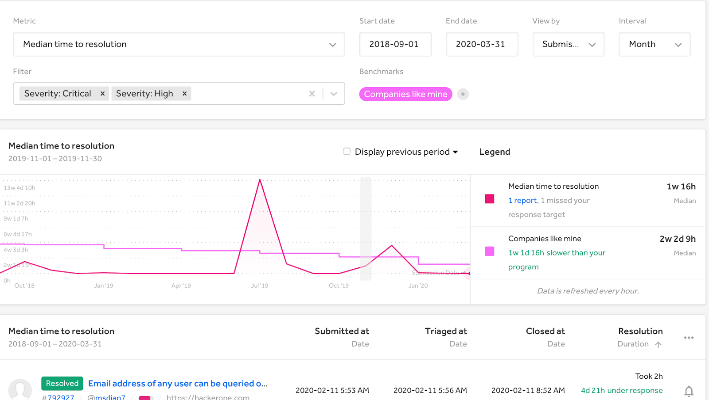
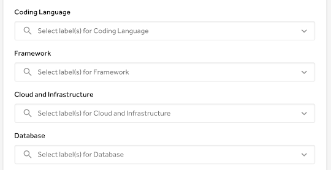
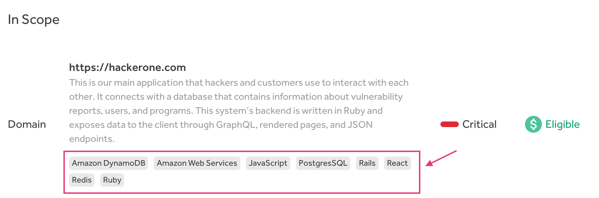

### Response Target Benchmarks
We introduce the new [response target benchmarks](/programs/response-target-benchmarks.html) dashboard that enables programs to compare their response times to those of other programs. This will help programs see what areas they need to focus on to improve their program.

### Asset Labeling
Programs can now add specific labels pertaining to their assets. These asset labels provide more granular data about each program and the assets associated with it, which will help with matching hackers to specific programs.

Programs can add asset labels to these categories:
* Coding Language
* Framework
* Cloud and Infrastructure
* Database
* Content Management System
* Country
* Spoken Language
* Cryptocurrency

### Updates to CVE IDs
We've made these improvements to [CVE IDs](/programs/cve-requests.html) to help users get their CVE IDs faster and to simplify the publication process:
* **Immediate CVE ID assignments:** Users will no longer have to wait in getting their CVE IDs as HackerOne will now immediately and automatically assign a CVE ID to a request created through HackerOne.
* **"Auto-Submission":** We now offer the new *Auto-submission* option in the CVE request process that'll enable CVE requests to be submitted automatically for approval and publication when the attached HackerOne report is publicly disclosed.
* **Publication Reminder Emails:** HackerOne will now send users weekly reminder emails of their CVE IDs that have yet to publish an advisory.
