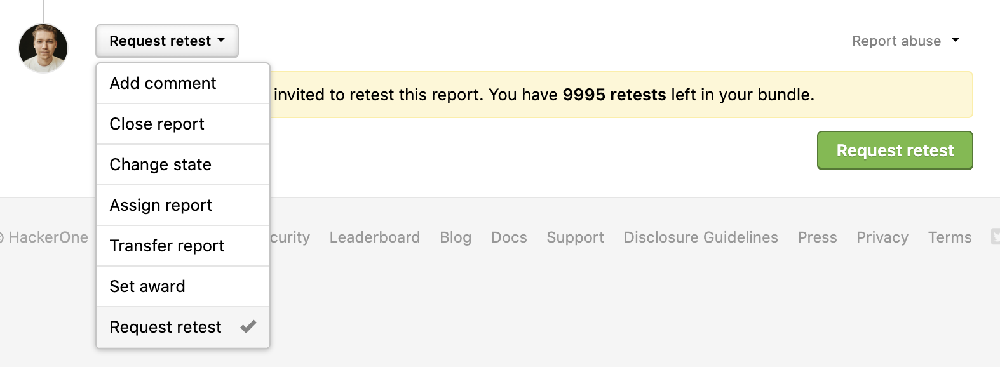

### Explore
We've revamped the Response Targets dashboard and now call it [Explore](/organizations/explore.html). Programs can now analyze their response targets, submissions and spend data, and Enterprise programs can also create benchmarks to see how they're doing in comparison to other programs.

### SAML Authentication Updates
Programs can now verify and enable [SAML authentication](/organizations/single-sign-on-sso-via-saml.html) on their own without needing to wait for HackerOne to approve their SAML request. We've also revamped the SAML authentication page and added guided steps to make the set up more clear.

### Domain Verification
We've also added a new [Domain Verification](/organizations/domain-verification.html) page where programs can verify ownership of their domains for the set up of SAML authentication.

### Hacker-Powered Retesting
We now officially offer Hacker-Powered [Retesting](/organizations/retesting.html) which enables programs to request hackers to verify that their vulnerabilities have been fixed.

### Revamped Report Submission Page  
We've redesigned the Report Submission Page to have a sleeker look.

### Report Preview Section
We've also added a new report preview section to the Report Submissions Page so that hackers can review their report details before submitting them.

