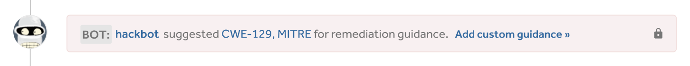
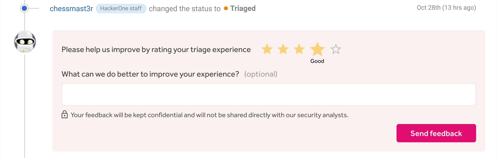

### In-report Remediation Guidance
[Hackbot](/programs/hackbot.html) can now provide remediation guidance from MITRE to help programs with mitigating their vulnerabilities. Through this, programs can also provide their own custom remediation guidance to communicate to their internal team.

### Triage Rating for Hackers
Hackers can now rate their triage experience for all managed programs they submit a report to. The ratings will be used to improve the triage experience for hackers.

