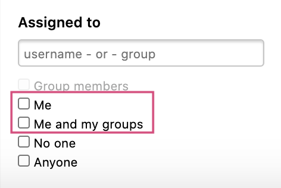
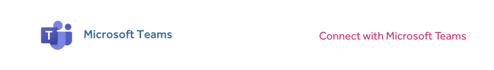
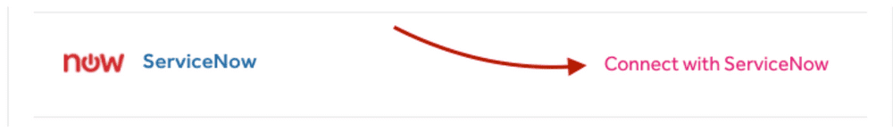

### Revamped Assigned To Filter
The `Me` filter for the **Assigned to** filter category now only shows reports that you are directly assigned to.

To see all of the reports that are assigned to you and the groups you are a part of, you can select the new `Me and my groups` filter. 

### Microsoft Teams Integration
We introduce the [Microsoft Teams integration](/organizations/microsoft-teams.html) to all Enterprise programs. This enables Microsoft Teams users to keep up-to-date with what's happening in their program as they can now receive notifications of HackerOne report activities directly in their selected channels.

### Bi-directional ServiceNow Integration
We now offer a bi-directional [ServiceNow integration](/organizations/servicenow-integration.html) to all Enterprise programs. This will create a better workflow of remediating security vulnerabilities as ServiceNow users can synchronize their HackerOne reports to ServiceNow incidents and vice versa, from ServiceNow to HackerOne.

