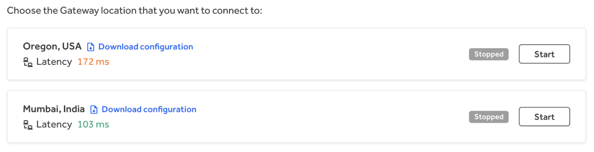
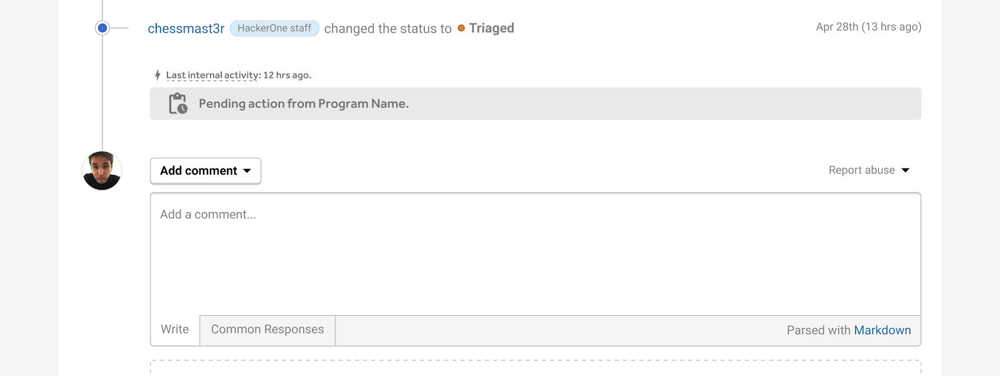
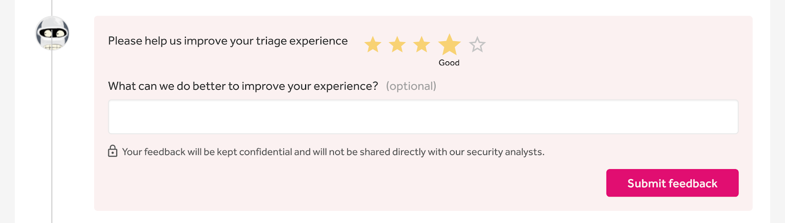
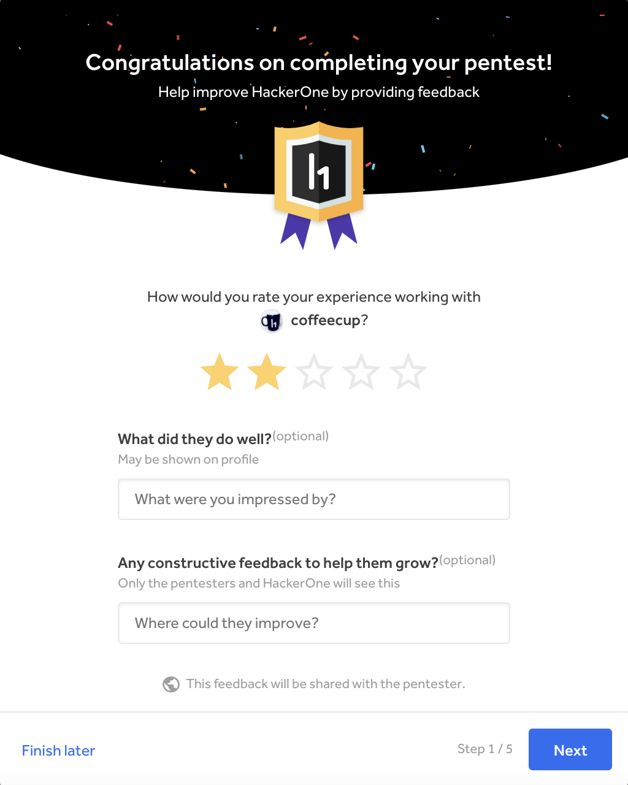
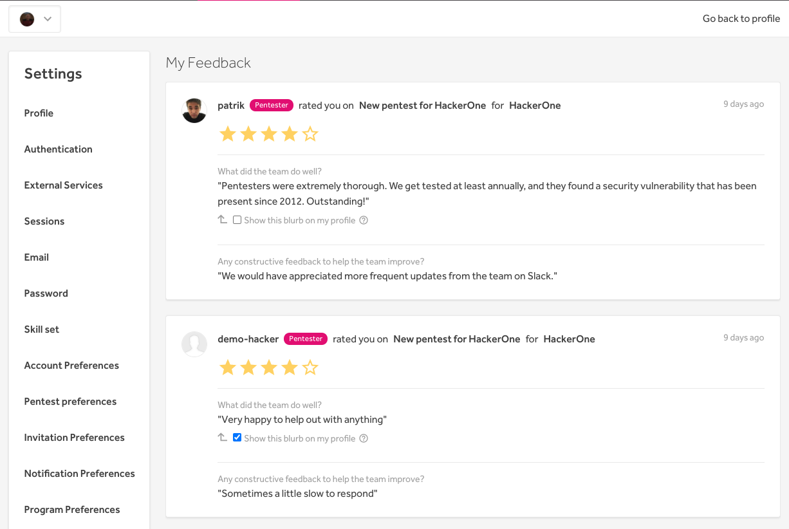
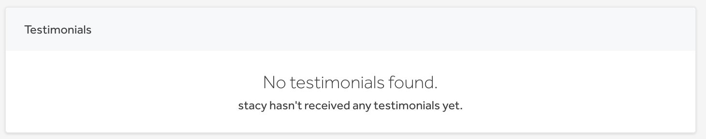

### Revamped Gateway (VPN) for Hackers
We’ve revamped the HackerOne Gateway (VPN) for hackers so that hackers can now choose to connect between these 2 different Gateway locations:
* Oregon, USA
* Mumbai, India

This gives hackers the ability to work on a VPN instance with a lower latency, which improves their Gateway experience with a faster connection.

### Report Transparency
We've increased report transparency for hackers by actively showing that their report is being looked at. This helps hackers to have more visibility in the triage process. To increase report transparency we show:
* The timestamp of the latest internal activity
* Defined labels of who is interacting with the report such as *HackerOne staff*
* Who is responsible for acting upon the report next
* Individual parameters used to calculate the CVSS score

### Triage Ratings
Programs managed by HackerOne can now rate their triage experience. The ratings will be used to improve the triage experience for managed programs.

### Pentest Ratings
We now enable pentesters to provide feedback about their pentest experience. Both pentesters and pentest programs can also provide feedback on the pentesters they worked with. This will enable pentesters and pentest programs to see what they've done well and/or how they can better improve.

### My Feedback
We've added a new **My Feedback** section to the hacker settings where pentesters can see all of the feedback they've received from pentesters and pentest programs they've worked with. They can also elect to make their feedback public on their profile.

### Testimonials
We've also launched a new **Testimonials** section on the hacker profile page where hackers can showcase their skills and the positive feedback they've received from other hackers.

