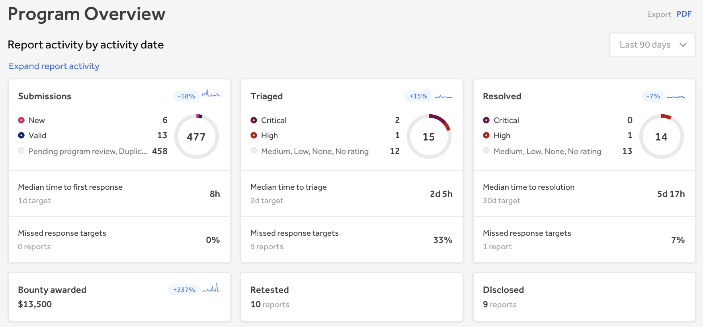
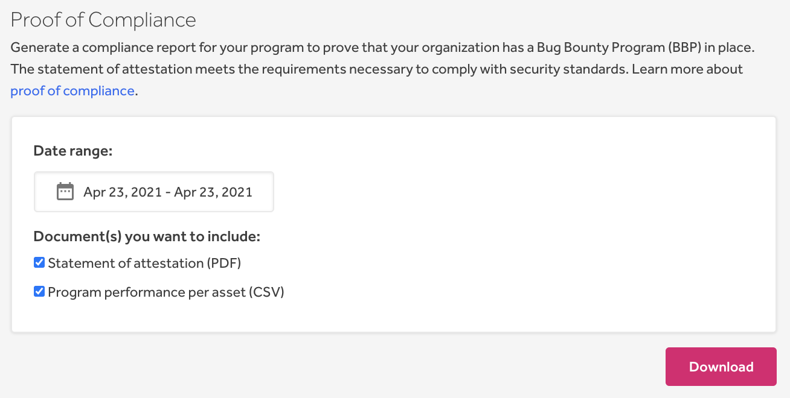
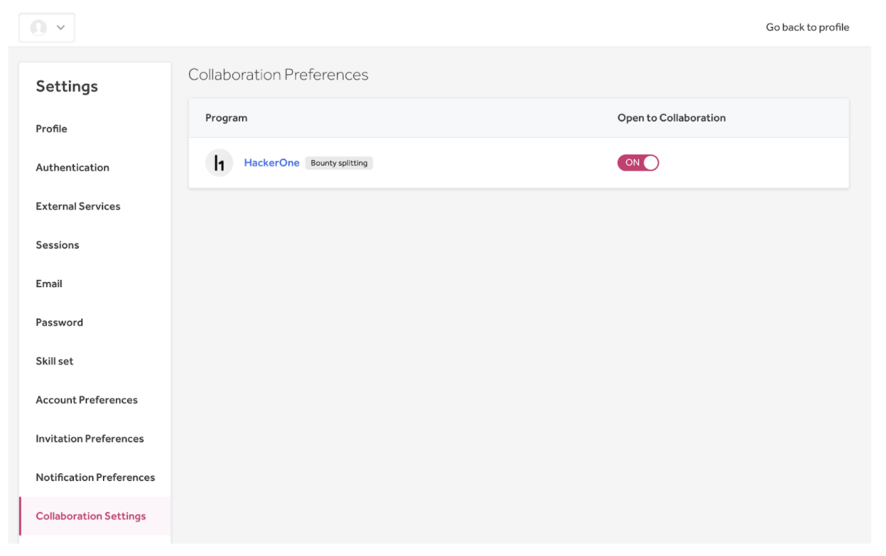
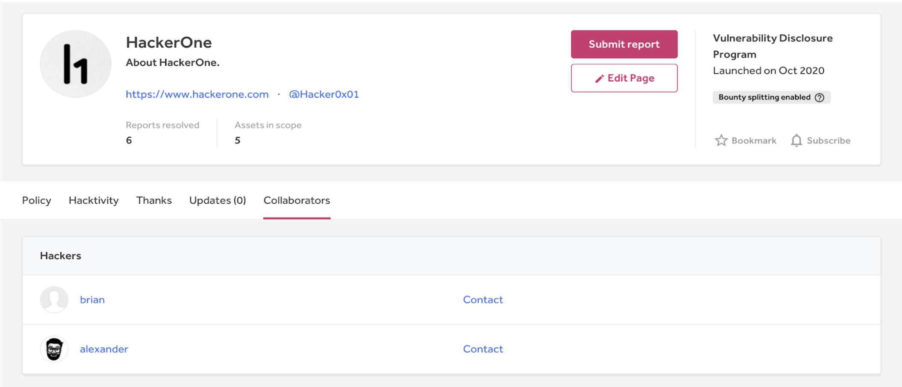
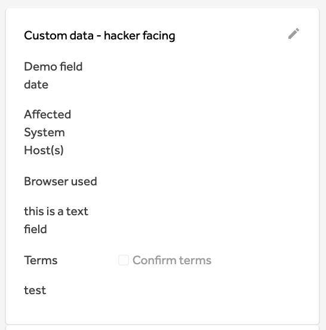

### Program Overview
We launch the new Overview page of the program dashboard to provide an overarching view of important data and statuses regarding your program.

### Proof of Compliance
You can now generate a proof of compliance report for your program on HackerOne to prove that your organization has a vulnerability disclosure policy (VDP) or bug bounty program (BBP) in place.

### Hacker Collaboration Preferences
Hackers can now set which programs they’re open to collaborating on so that they can work with other hackers in finding vulnerabilities.

### Collaborators Tab on the Security Page
We introduce the new Collaborators tab on the program’s security page, where you can see which hackers are open to collaboration and contact them.

### Hacker Custom Fields
Programs can now create hacker facing [custom fields] to require specific information from hackers regarding the vulnerability they found. This speeds up the remediation process as it’ll minimize the back-and-forth between the hacker and the program in getting necessary information.

