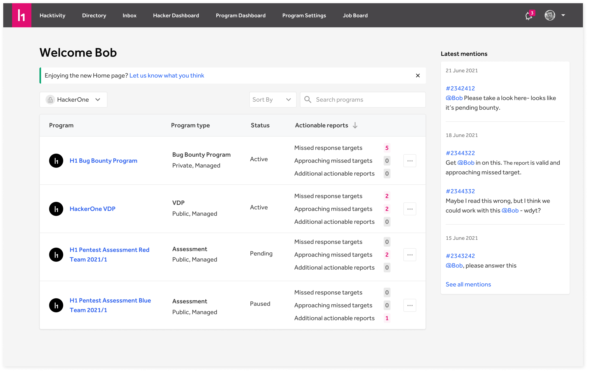
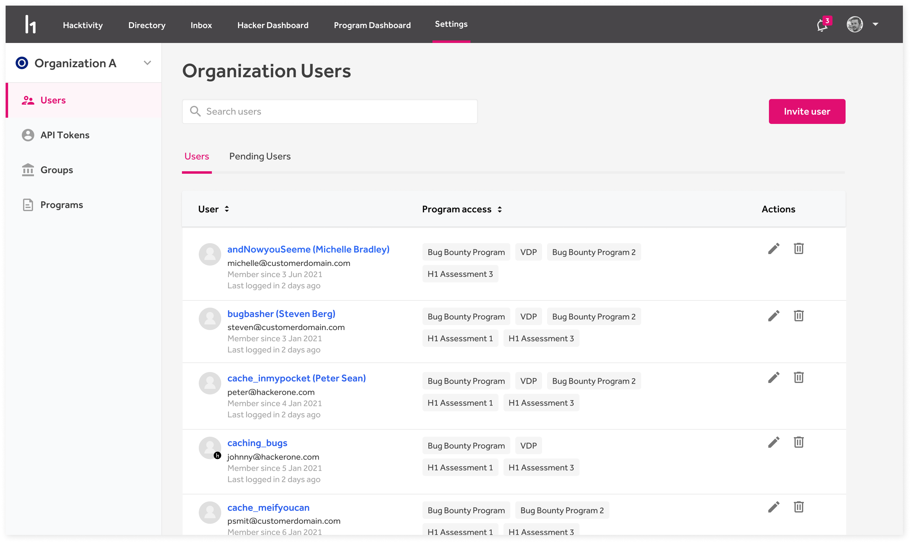

### Customer Homepage
The [customer homepage](/organizations/homepage.html) is the starting point for customers to see an overview of all programs and latest report activity and mentions in their organization. Quickly access the area that requires your attention, regardless of the program it's associated with.

### Organization-level User Management
Managing all team members from a central place with our new Organization-level [User Management](/organizations/user-management.html). Regardless of which program they can access, you can now manage team members and API access from a single location.

### Report sidebar
Improving the user experience while viewing reports. Making it easy to see all relevant information at a glance while taking action on a report.

### Ability to search in the program picker
You can now search for programs in the Program picker to easily find the right program you are looking for.

### New Splunk integration Setup
The [Splunk integration](/organizations/splunk-integration.html) is now embedded into the HackerOne platform to make it easier to setup and maintain the integration.
