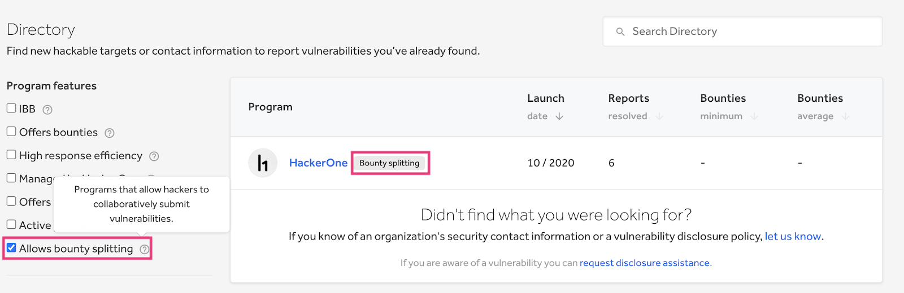
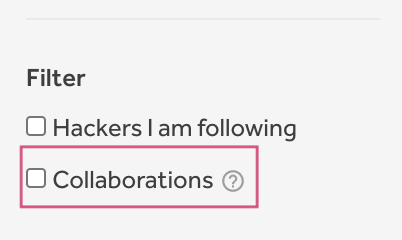
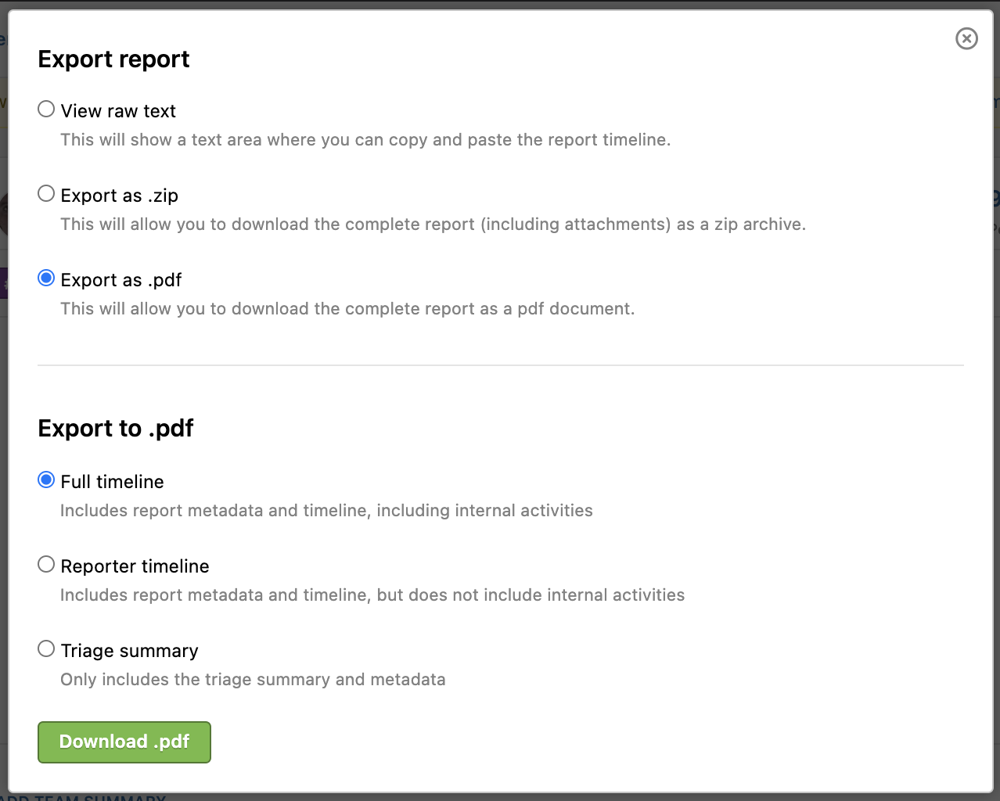

### Azure DevOps Integration
Enterprise programs can now integrate HackerOne with [Azure DevOps](/organizations/azure-devops-integration.html) to synchronize their HackerOne events to Azure DevOps and vice versa.

### Support for Multiple Integrations
Programs can now set up [multiple integrations](/organizations/supported-integrations.html#using-multiple-integrations) with HackerOne and select which issue tracker they want to add a reference to.

### Add Reference to Issue Tracker
We've updated the reference ID field for adding integrations with a new **Add reference to issue tracker** button to more clearly guide users with adding a reference to their integrated issue tracker.

### Filter Programs by Collaboration
You can now see which programs enable you to collaborate with other hackers in submitting vulnerabilities with the new *Collaboration* filter and label in the [Directory](https://hackerone.com/directory/programs).

### Collaborations Filter in Hacktivity
We've added the new **Collaborations** filter in Hacktivity so that hackers can easily see which reports were collaborated on.  

### Export Reports to PDF 
You can now [export your reports to a PDF](/organizations/export-reports.html#export-to-md-zip-or-pdf-files) and choose to include the full timeline, the reporter timeline, or the triage summary when exporting.

