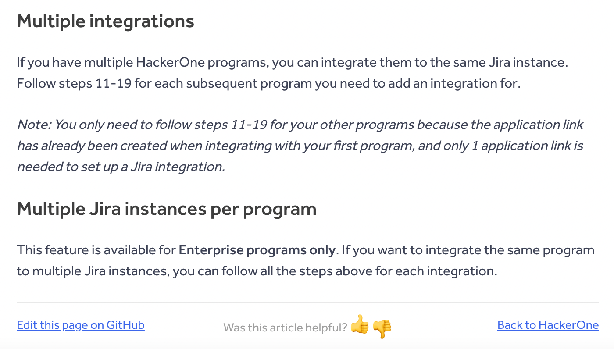
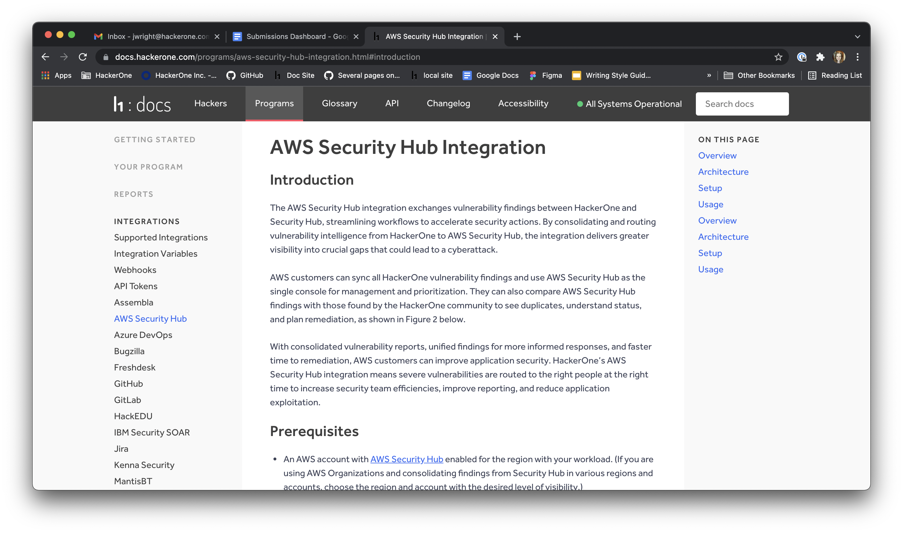

### Multiple Jira Integration
This feature is available for Enterprise programs only. If you want to integrate the same program to [multiple Jira instances](/organizations/multiple-jira-integrations.html), you can follow all the steps for each integration.

### AWS Security Hub Integration
The [AWS Security Hub integration](/organizations/aws-security-hub-integration.html) exchanges vulnerability findings between HackerOne and Security Hub, streamlining workflows to accelerate security actions. 

