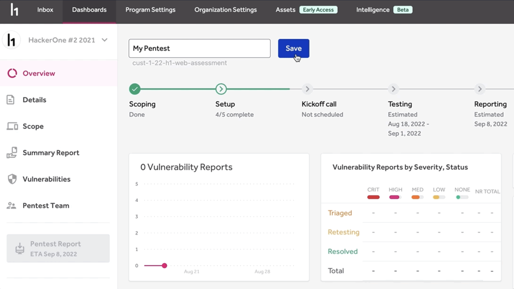
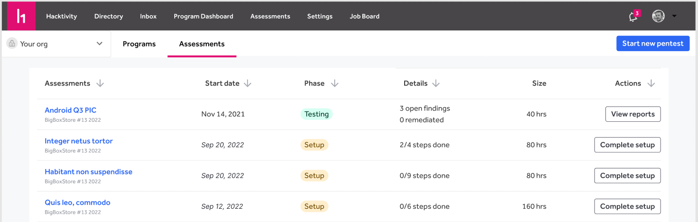
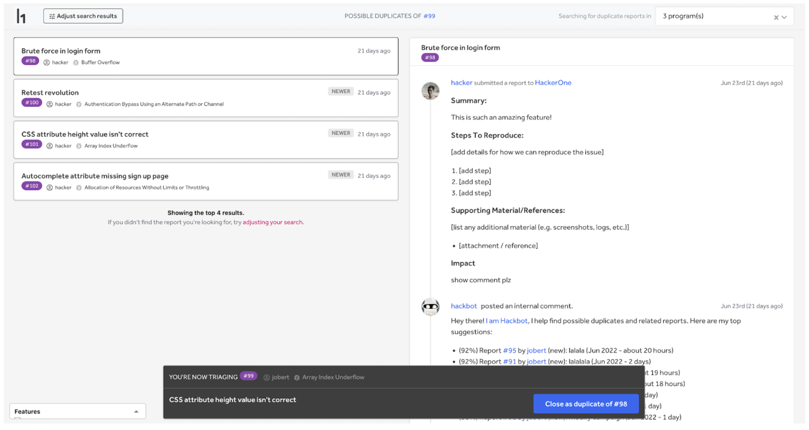

### Custom Pentest Naming
Custom Pentest Naming allows all Pentest customers to customize their pentest names according to their internal conventions. To use Custom Pentest Naming, go to the Overview of a pentest, click the title, and save. The new name will populate instantly across the platform.

### Pentest Tables
Pentest Tables enable team members to view all of their Pentests in one place. To see Pentest Tables in action, go to the organization landing page and click on the "Pentests" tab. You will also be redirected to this tab if the selected organization has no non-pentest programs.

### Duplicate Detection
The [Duplicate Detection Console](/organizations/duplicate-detection.html) streamlines customers' ability to detect duplicate reports across all their programs.

