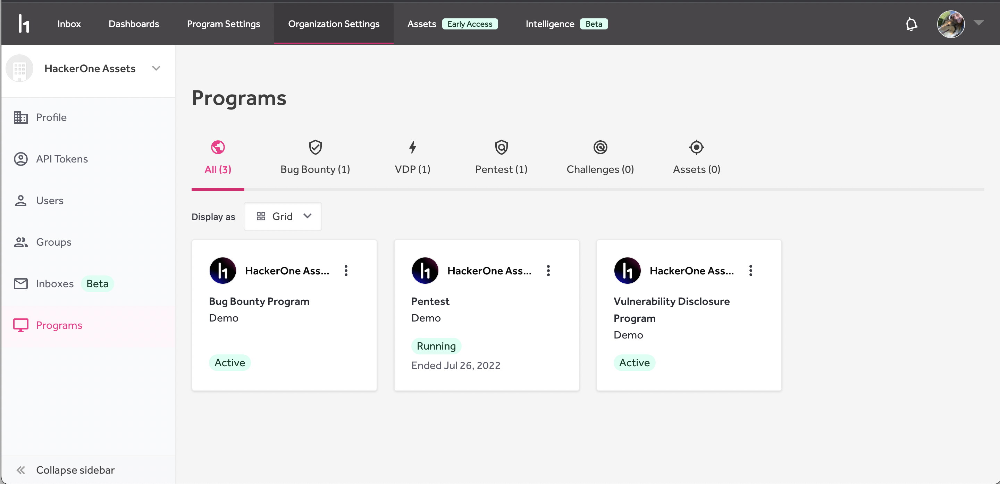
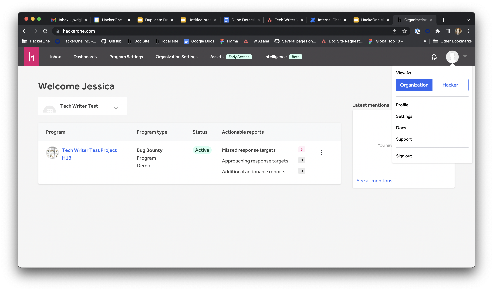

### Programs Landing Page
Customers will now be able to see all programs for their organization under Organization Settings > Programs, and will be able to navigate to all the relevant areas for that program from there.

### Unassign reports
There is now an "Unassign Report" option in the action picker at the bottom of a report. Users can also unassign reports in bulk by selecting multiple reports in the inbox. 

### HackerOne Views
Users can now switch between Organization view and Hacker view using the dropdown next to the avatar in the top right of the navigation bar.

