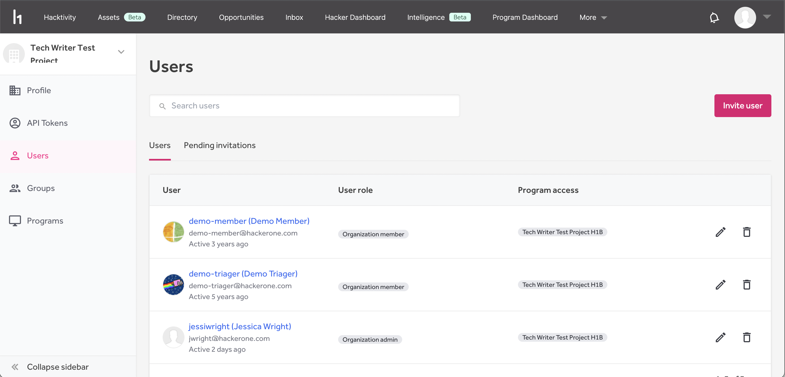

### Retesting Enhancement
The tester will now have 72 hours to complete retesting once a retest is claimed.

### Program Hacker Matching Improvement
We’ve made improvements to our Invitation Engine. Using program requirements and customer preferences to match hackers to opportunities, we provide our hacker community with much more personalized recommendations.

### Organization Settings Page
The Organization Settings page allows customers with multiple programs to manage users from a single page.

### Program Dashboard Enhancements
We released fixes and performance optimizations to ensure consistent data between the Statistics page and the [Submissions and Bounty dashboard.](/organizations/submissions-bounty-dashboard.html)

### Team Member Eligibility
[Team Member Eligibility](/organizations/team-member-eligibility.html) settings allow you to configure a list of email domains that are eligible to join your program. These settings will allow or block a user when accepting an invitation, but will not affect any users that are already a member of the program. You can set team member eligibility regardless of SAML usage.
