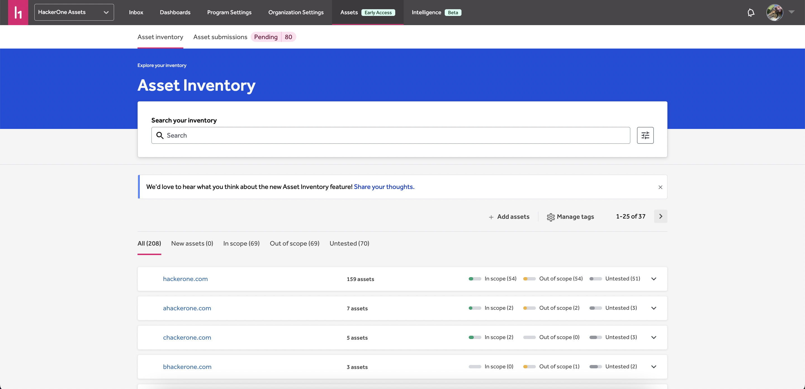
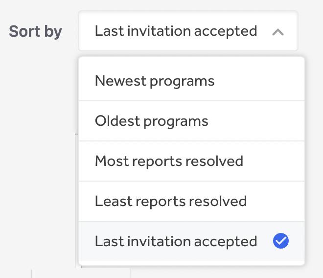

### HackerOne Assets
HackerOne Assets combines the core capabilities of Attack Surface Management (ASM) and Asset Inventory with the reconnaissance skills of ethical hackers to bring visibility, tracking, and risk propensity to an organization’s digital asset landscape.

### My Programs Filters
Hackers can now sort programs by the last accepted invitation date on the My Programs page under [Opportunities](https://hackerone.com/opportunities/my_programs).

