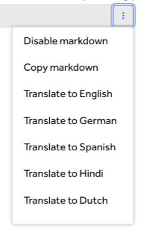

### Retesting Timeframe
The 72hr timer from retests has been removed, so there will be no time limit to accept or confirm retests.

### Report Translations
Hacker reports and responses can be translated into Dutch, German, Hindi, and Spanish. To translate, click on any part of the report and select a language in the kabob menu (3 vertical dots). You have to select each response to translate it, and it works on both Inbox and public Hactivity content.

### Custom Asset Groups
Customers can now group assets by tags, including any custom tags they have made! The sorting stays in place during searches as well, so all results will be sorted. Customers can also choose no grouping to show a full list of assets.

### CVE Discovery in ASM Scans
If the ASM scanner finds a risk that contains a CVE, clicking the CVE ID will now open our own intelligence tab with more information about the CVE. The platform context helps customers make better decisions on the importance and urgency of the risk.

