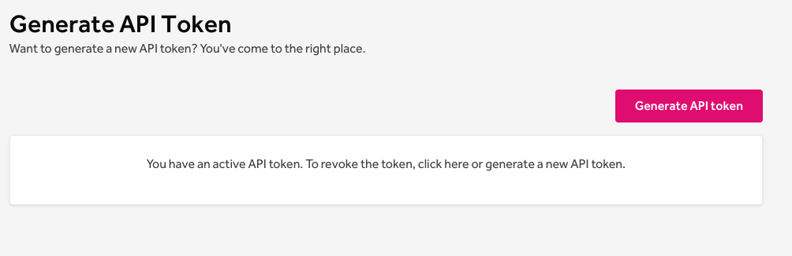
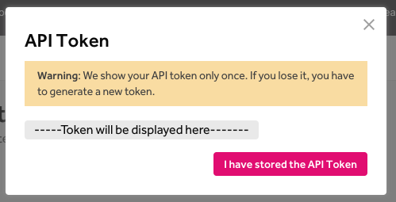

You can generate an API token to experiment with or use the HackerOne API. The API token identifier and value are used as the username and password for HTTP Basic authentication

### Generating a personal API token

In order to generate a personal access token, please follow these steps:

1. Sign in to your HackerOne account
2. Visit the [API Token](https://hackerone.com/settings/api_token/edit) page in your account settings

3. Click **Generate API Token** to generate a new token (This will revoke any previously generated token)
4. The token will only be shown once, so make sure to store it well

### Revoking your API token

In order to revoke a token, you can do one of the following:

1. Generate a new API token
2. Revoke the token by clicking **click here** on the API Token settings page

