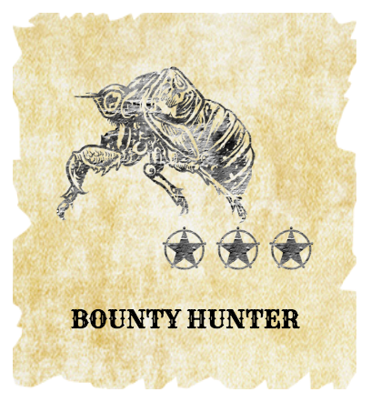

Badges are emblematic awards you can receive when you meet certain criteria or achieve events. Once received, these badges are publicly show-cased on your profile page to show your accomplishments and skills. See: hackerone.com/[hacker-name]/badges. 

All badges are represented by different images of bugs. Some badges have many levels depending on different criteria. These levels are represented by stars on the badge.

When you receive a badge for your profile page, each badge is composed of: 
* The name of the badge
* A short description of what the badge is about
* The date you achieved the badge

The following lists all of the current badges with a description of how to receive them: 

Badge | Description 
-|-
Badger | Made a badge suggestion that was implemented by HackerOne
Belle Of The Ball | Submitted the top ranked report on the Hacktivity feed
Bounty Hunter | 1, 10, or 100 bounties received. <i>There are multiple stages of this badge. You receive this badge whenever you receive 1, 10, and 100 bounties.</i>
Champ | Received when you get 1st, 2nd, or 3rd place on a quarterly leaderboard
Coinage | Submitted a valid report during a HackerOne hackathon
Cryptolestes | Solved a HackerOne Capture The Flag challenge
Diversity | Reported bugs to 5, 20, or 50 different teams. <i>There are multiple stages of this badge. You receive a level of this badge whenever you report bugs to 5, 20, and 50 different teams.</i>
Good Samaritan | Resolved a report with a team that doesn't pay bounties
Greybeard | Submitted valid reports in 3, 6, or 12 months in a row. <i>There are multiple stages of this badge. You receive a level of this badge whenever you submit valid reports in 3, 6, and 12 months in a row.</i> 
Hack The World Badass | Reported 10, 20, or 50 valid issues during Hack the World. <i>There are multiple stages of this badge. You receive a level of this badge whenever you submit 10, 20, and 50 valid reports.
Hacking Hackers | Hacked HackerOne
Happy Feat | Suggested a feature that was implemented on HackerOne
Insecticide | 1, 50, or 500 reports closed as resolved. <i>There are multiple stages of this badge. You receive a level of this badge when 1, 50, and 500 reports are closed as resolved.</i>
On Fire | Reported 10, 15, or 20 valid issues in a row during Hack the World. <i>There are multiple stages of this badge. You receive this badge whenever you report 10, 15, or 20 valid issues in a row.</i>
Patient | Waited more than six months for a report to get resolved
Publish Or Perish | Publicly disclosed a report
Skills | Got 1, 3, and 5 or more verified skills. <i>There are multiple stages of this badge. You receive a level of this badge when you have 1, 3, and 5 or more verified skills. 
Spooky | Submitted a valid report to the DoD
Streaker | Received when 2, 5, or 10 reports in a row were closed as resolved. <i>There are multiple stages of this badge. You receive this badge when 2, 5, or 10 reports are closed or resolved in a row.</i>
Swagger | Received swag for the first time
Trailblazer | Was the first of multiple reporters to report a vulnerability

Keep in mind that some badges are event-based.  
