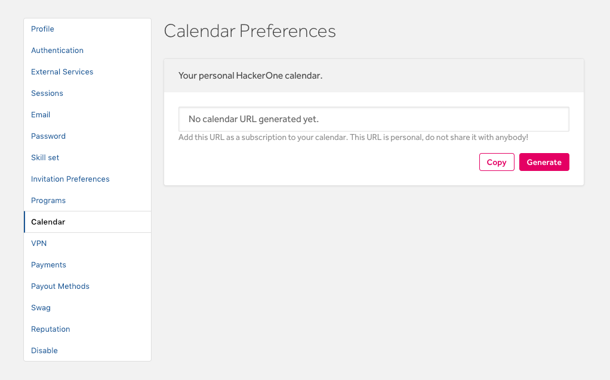
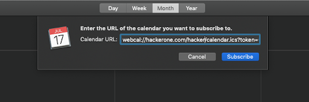
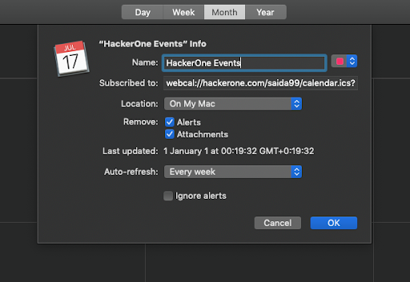
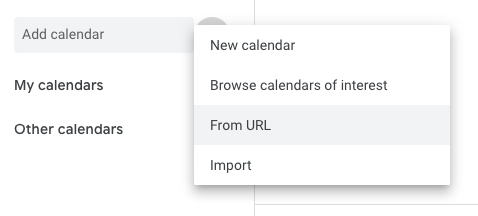
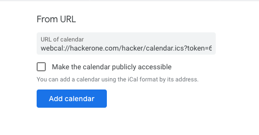

You can add your HackerOne calendar to your own personal calendar. By syncing your calendar, you can easily keep track of the:
* Date you joined HackerOne
* HackerOne Challenge dates you're invited to

You can sync your HackerOne calendar with your personal calendar on Google calendar and Apple calendar.

To add your HackerOne calendar to your personal calendar:
1. Go to your profile **Settings > Calendar**.

2. Click **Generate** to generate your personal calendar URL.
3. Click **Copy** to copy the URL.
4. Import your HackerOne calendar URL to your personal calendar in [iCal](#iCal) or [Google Calendar](#Google).

You can choose to regenerate your calendar URL by clicking **Regenerate**. Keep in mind that if you regenerate your URL, your calendar on the old URL won't be updated with new events. Only the current URL will be actively synced with new events.

### Importing to iCal

1. Go to **File > New Calendar Subscription** in Calendar.

2. Enter your HackerOne calendar URL and click **Subscribe**.

3. Enter a name for your calendar and choose a color to help you identify it on your calendar.
4. Choose how frequently you want to refresh the events in the **Auto Refresh** field.
5. Click **OK**.

### Importing to Google Calendar

1. Open [Google Calendar](https://calendar.google.com/).
2. Add a new calendar by selecting **From URL**.

3. Enter your HackerOne calendar URL.

4. Click **Add Calendar**.
5. *(Optional)* Go to **Settings** in your Google Calendar.
6. *(Optional)* Select the HackerOne calendar and enter a name for it. You can also choose a color to help you better identify it on your calendar.
