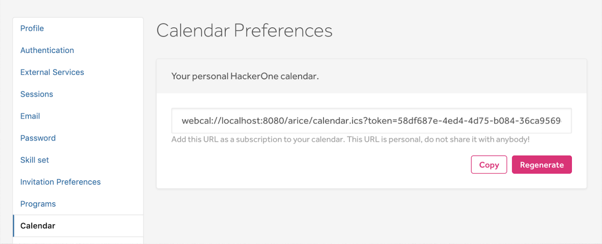

The Calendar Preferences feature enables you to add the HackerOne calendar to your own personal calendar. By syncing your calendar, you can easily keep track of the:
* Date you joined HackerOne
* HackerOne Challenge dates you're invited to

You can sync your HackerOne calendar with your personal calendar on Google calendar and Apple calendar.

To add your HackerOne calendar to your personal calendar:
1. Go to your profile **Settings > Calendar**.

2. Click the **Generate** button to generate your personal calendar URL.
3. Click **Copy** to copy the URL.
4. Import your HackerOne calendar URL to your personal calendar.

The HackerOne calendar will populate into your personal calendar. 
