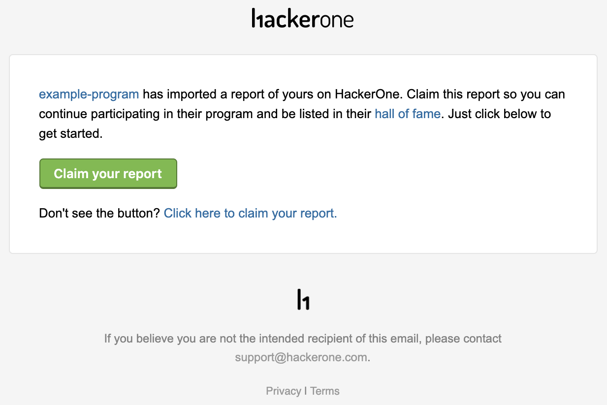
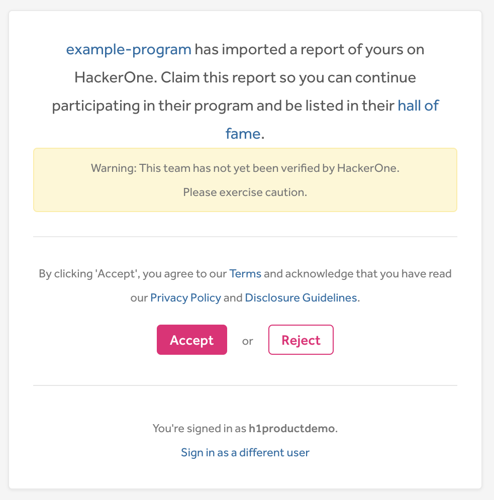

Programs can import your reports from external issue trackers into HackerOne. When reports are imported, you’ll be invited to claim your report so that you can continue to access and work on them as well as earn reputation for reputable reports.

You’ll receive Invitations to claim your reports through email. To claim your report:  

1. Open the email you received to claim your report.
2. Click <b>Claim your report</b>.

3. Select to either **Accept** or **Reject** the invitation to claim the report.

If you accept to claim your report, you’ll have access to your report in HackerOne where you can take [actions](report-actions.html) on the report. Depending on the [report state](report-states.html), you’ll also properly be awarded with [reputation](reputation.html).  If you select to reject the invitation, you won't be able to contribute to the report.
