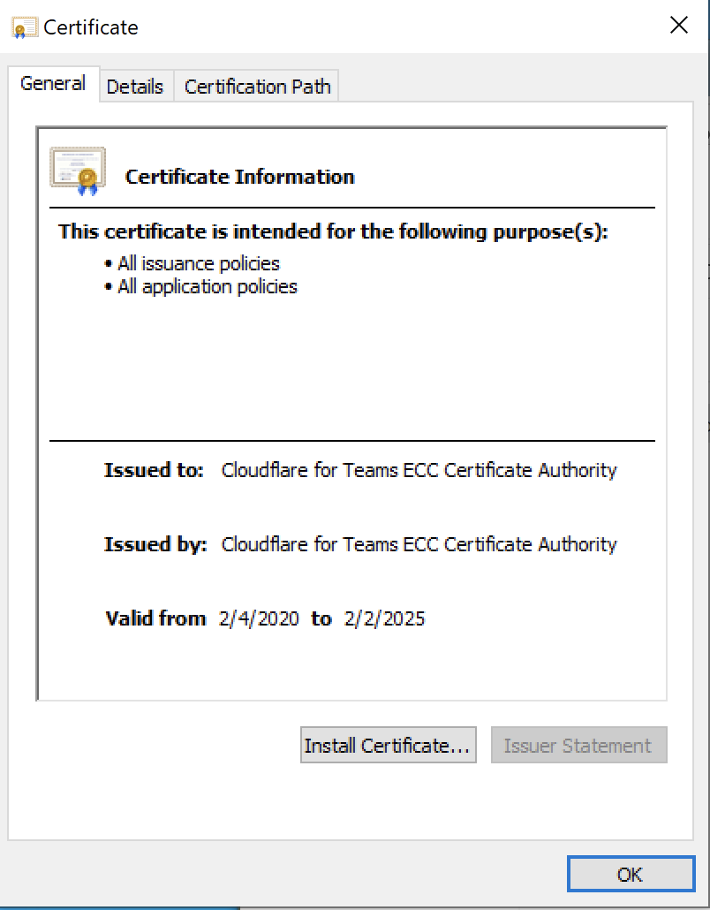
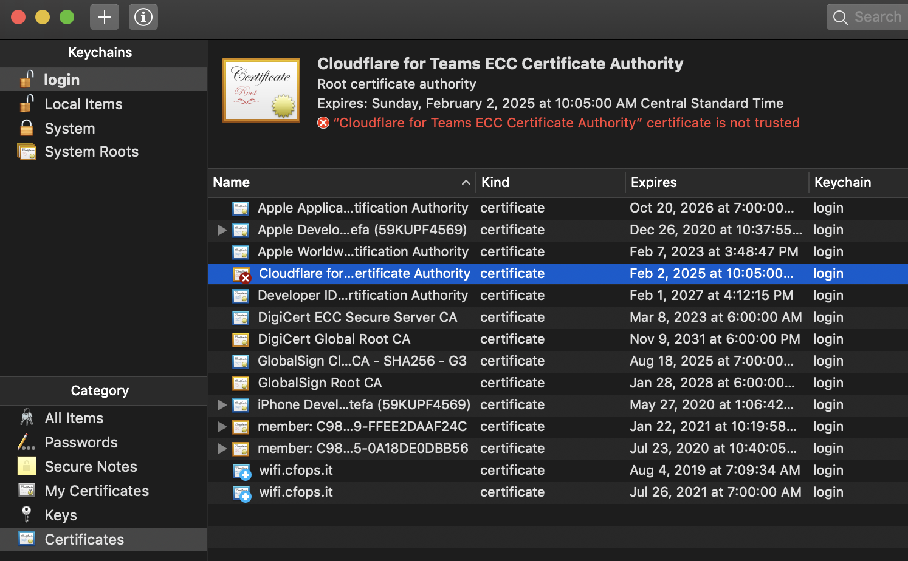

In order to use the HackerOne Gateway, you need to install the Cloudflare for Teams ECC Certificate Authority.

Refer to these installation and configuration instructions for your platform:

* [Windows](#windows)
* [macOS](#macos)
* [Ubuntu/Debian Linux](#ubuntudebian-linux)
* [Firefox](#firefox)

><i>Note: Firefox manages its own trusted certificate list, so you always need to add the root authority certificate to the browser even if you've installed it system wide.</i>

### Windows

To install the HackerOne VPN Root CA to your Windows machine:

1. [Download the Cloudflare for Teams Root CA](https://developers.cloudflare.com/cloudflare-one/static/documentation/connections/Cloudflare_CA.crt).
2. Right-click the certificate file. 
Click Open. If you see a Security Warning, click Open to proceed.

3. Click <b>Install Certificate...</b>.

4. Select <b>Local Machine</b> and click <b>Next</b>.

5. Click <b>Yes</b> to allow the changes.

6. Select <b>Place all certificates in the following store</b>.

7. Select <b>Trusted Root Certification Authorities</b> from the list and click <b>OK</b>.

8. Click <b>Finish</b>.

### macOS

To install the Cloudflare for Teams ECC Certificate Authority to your macOS platform:

1. [Download the Cloudflare for Teams Root CA](https://developers.cloudflare.com/cloudflare-one/static/documentation/connections/Cloudflare_CA.crt).

2. Double-click the .crt file.
In the pop-up message, choose the option that suits your needs (login, Local Items, or System) and click Add.

3. Double-click on the Cloudflare for Teams ECC Certificate Authority in KeyChain Access.

4. Set the certificate to <b>Always Trust</b> in the window that appears.

### Ubuntu/Debian Linux

Execute the following commands in your terminal to download and install the HackerOne VPN Root CA:

1. `cd /usr/local/share/ca-certificates`
2. `sudo wget https://developers.cloudflare.com/cloudflare-one/static/documentation/connections/Cloudflare_CA.crt`
3. `sudo update-ca-certificates`

The command will state that it has installed one (or more) new certificates, through which the certificate has been successfully added to the Operating System.

### Firefox

To install the HackerOne VPN Root CA to Firefox:

1. [Download the Cloudflare for Teams Root CA](https://developers.cloudflare.com/cloudflare-one/static/documentation/connections/Cloudflare_CA.crt).
2. Open <b>Preferences</b> and go to <b>Privacy & Security</b>.
3. Scroll down to the <b>Certificates</b> section, and click <b>View Certificates...</b>.

4. Click the <b>Import...</b> tab.

5. Select the <b>Cloudflare_CA.crt</b> file.

6. Check <b>Trust this CA to identify websites</b> and click <b>OK</b>.

The "Cloudflare for Teams ECC Certificate Authority" certificate is now visible in your list of certificates.

