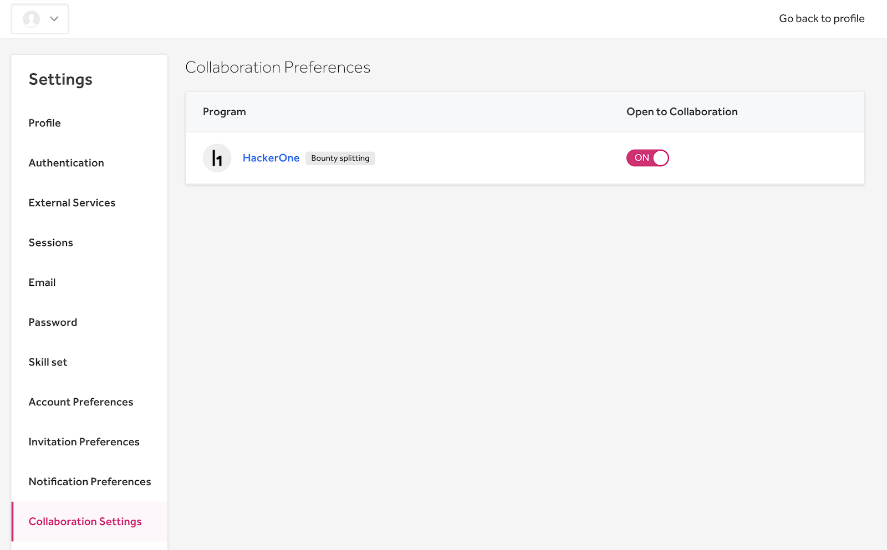
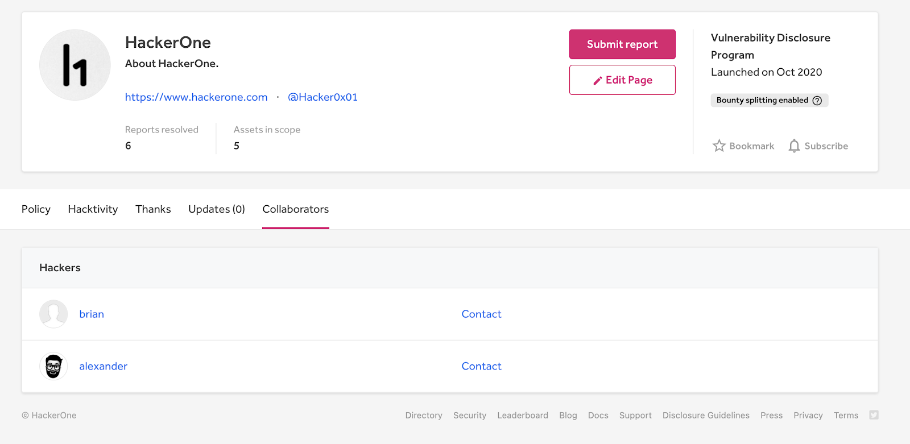

You can collaborate with other hackers in finding vulnerabilities for the programs you’re a part of. This enables you and other collaborating hackers to share resources and any knowledge you each may have about a vulnerability as you work together to uncover security issues. Collaboration is a great way to find vulnerabilities as putting multiple heads together may be better than just one.

If you’re collaborating with other hackers, you can [split the bounty amount](https://docs.hackerone.com/hackers/payments.html#bounty-splitting) so that each hacker is rewarded appropriately. In addition, each collaborator on the report will earn reputation points for their contribution. A collaborator needs to accept the collaboration invite before the report is awarded to gain reputation and bounty.

To let other hackers know that you’re open to collaboration:
1. Go to your profile’s **Settings > Collaboration Settings**.
2. Click the toggle to be **ON** for each of the programs you’re open to collaborating on. The list of programs that appear will include all private programs you’re a part of as well as all public programs you’ve submitted a report to.

Once you’ve selected the programs you’re open to collaborating on, the security page of the program will have a **Collaborators** tab where you can view all of the other hackers that are open to collaborating and be able to contact them so that you can work together.

