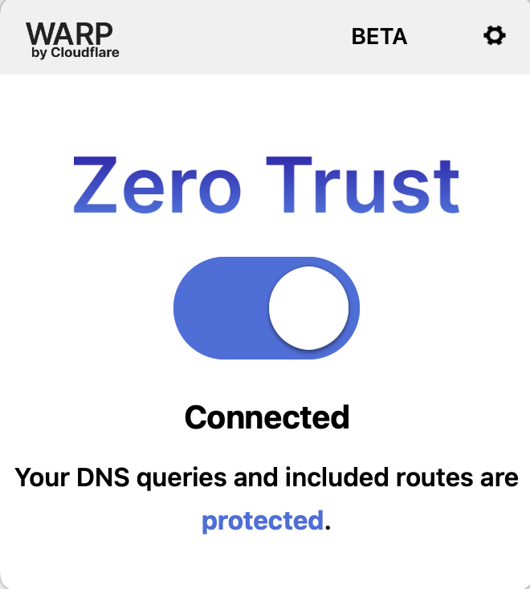

HackerOne Gateway NG (VPN) specific programs require you to be connected to the Program Gateway NG (VPN) instance in order to search for vulnerabilities. In joining a Gateway NG (VPN) program, HackerOne will capture all of the VPN packet data you generate with your work on the program.

All captured packet data will be securely deleted from all HackerOne systems after 1-year following the completion of the program. HackerOne will only use the captured packet data for:
* Troubleshooting and debugging
* Incident responses
* Generating statistics for reports to programs
* Improving delivery of programs and services

HackerOne will not use the captured packet data for any other purposes and will only be shared with the program. The program may retain the data for compliance and auditing.

Programs requiring Gateway NG (VPN) enable them to have granular control over your activities on their program and assets.

> **Note:** You can only access the HackerOne Gateway NG (VPN) if you've accepted an invitation to the Gateway NG (VPN) enabled program.

If you have trouble installing the Gateway NG (VPN) or have additional feedback, please reach out to [vpn-support@hackerone.com](mailto:vpn-support@hackerone.com).

### Set up

To join a program that uses VPN and to set up the Gateway NG (VPN):
1. Click **View Invitation** in the email for the Gateway program you’ve been invited to.
2. Look over the program details on the program page.
3. Click **Start hacking** to join the program.
4. Install the WARP Client by following the instructions here: [Installing the WARP Client](/hackers/warp-client-install.html).
5. Configure your WARP Client by following the instructions here: [Configure your WARP Client](/hackers/warp-client-config.html).
6. [Install the HackerOne VPN Root CA](/hackers/hackerone-vpn-root-ca.html).

### Using Gateway NG (VPN)
### Windows/macOS
Click the button in the client

### Linux
Use the following cli command:
`warp-cli connect`

>**Note:** If you’re a part of a *Full Tunnel* Gateway program, all of your activity will be captured while you you are connected to VPN. Please be sure to avoid logging in to accounts where personal information can be recorded such as bank accounts.   