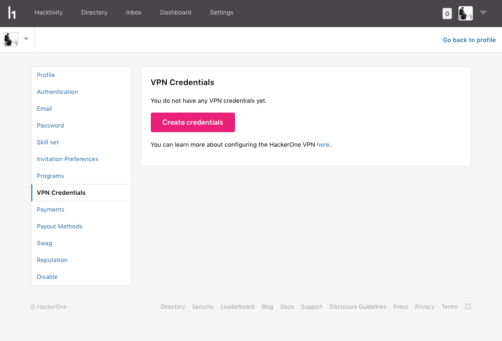
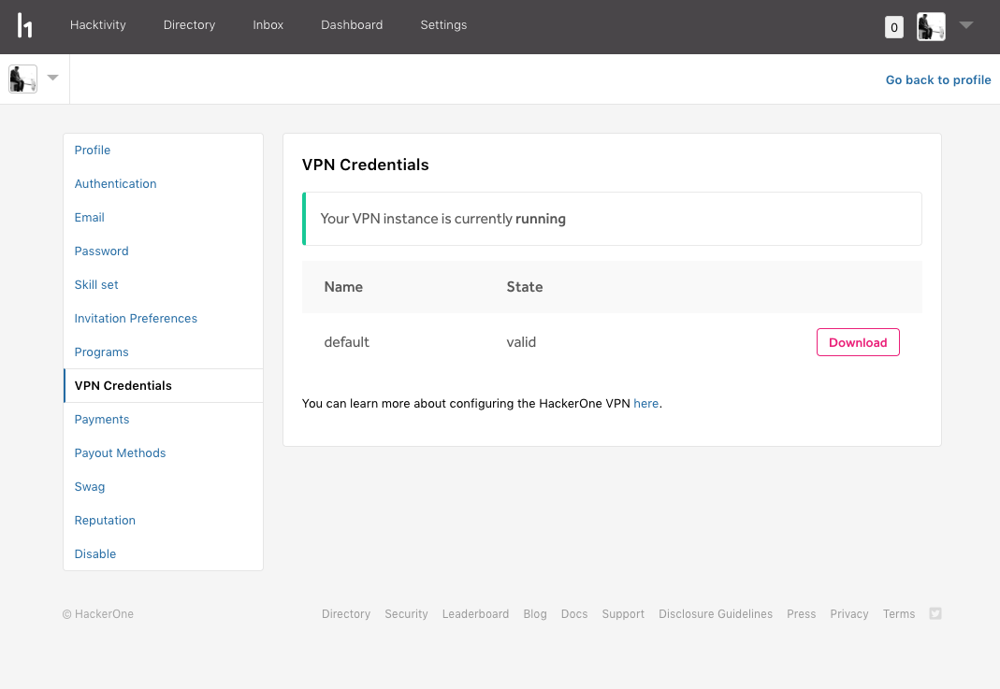

Certain programs require you to have your own VPN instance and credentials on HackerOne Gateway (VPN) in order to search for vulnerabilities. You can configure HackerOne Gateway (VPN) to start your own VPN instance and retrieve your credentials.

><i>Note: HackerOne Gateway (VPN) is currently only enabled for a few select programs. You can only access the VPN Credentials if you've accepted an invitation to a Gateway(VPN) enabled program.</i>

### Gateway (VPN) Configuration
To configure the HackerOne Gateway (VPN):
1. [Install the HackerOne VPN Root CA](/hackers/hackerone-vpn-root-ca.html).
2. Download your Gateway(VPN) Credentials from HackerOne (See: <i>Accessing your Gateway (VPN) Credentials</i> below)
3. [Configure your OpenVPN Client](/hackers/openvpn-clients.html).

### Accessing your Gateway (VPN) Credentials

Once you've configured HackerOne Gateway (VPN) and accepted an invitation to a Gateway (VPN) enabled program, to access your Gateway (VPN) Credentials:

1. Go to your <b>Settings > VPN</b>.
2. Click <b>Create credentials</b> to generate your Gateway (VPN) credentials. <i>Note: It'll take a few minutes to generate your credentials. Sorry for the wait!</i>

3. Click <b>Download</b> to download the <code>hackerone.ovpn</code> file.

4. Import the <code>hackerone.ovpn</code> file in the OpenVPN client that you've configured.

You'll be able to access your Gateway (VPN) credentials and work securely within HackerOne Gateway (VPN) to search for vulnerabilities. Every hacker will have their own Gateway (VPN) instance. You can check to see that your Gateway (VPN) instance is running successfully on the Gateway (VPN) page.

If you have trouble installing the Gateway (VPN), or have additional feedback, please reach out to [vpn-support@hackerone.com](mailto:vpn-support@hackerone.com)
