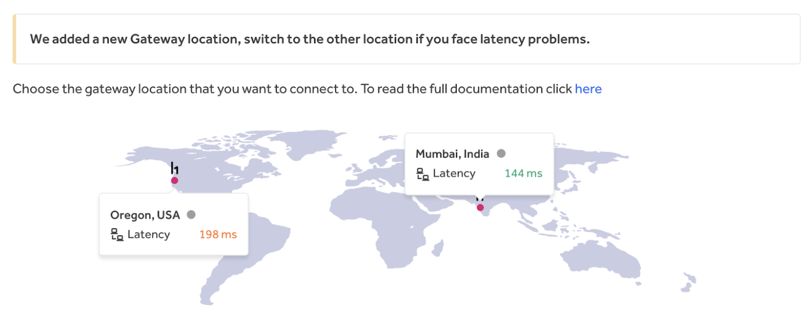

HackerOne Gateway (VPN) specific programs require you to be connected to the HackerOne Gateway (VPN) instance in order to search for vulnerabilities. In joining a Gateway (VPN) program, HackerOne will capture all of the VPN packet data you generate with your work on the program.

All captured packet data will be securely deleted from all HackerOne systems after 1-year following the completion of the program. HackerOne will only use the captured packet data for:
* Troubleshooting and debugging
* Incident responses
* Generating statistics for reports to programs
* Improving delivery of programs and services

HackerOne will not use the captured packet data for any other purposes and will only be shared with the program. The program may retain the data for compliance and auditing.

Programs requiring Gateway (VPN) enable them to have granular control over your activities on their program and assets.

> **Note:** You can only access the HackerOne Gateway (VPN) if you've accepted an invitation to a Gateway(VPN) enabled program.

If you have trouble installing the Gateway (VPN) or have additional feedback, please reach out to [vpn-support@hackerone.com](mailto:vpn-support@hackerone.com).

### Set up

To join a program that uses VPN and to set up the HackerOne Gateway (VPN):
1. Click **View Invitation** in the email for the Gateway program you’ve been invited to.
2. Look over the program details on the program page.
3. Click **Start hacking** to join the program.
4. Click **Configure VPN** in the banner on the program page. This will take you to the main Gateway (VPN) page where you can configure your VPN on HackerOne. You can also visit the Gateway (VPN) page directly by going to: https://hackerone.com/settings/vpn

5. Wait a couple of seconds for HackerOne to create your VPN configurations and add Gateway locations. You’ll see these 3 Gateway locations once your VPNs have been configured:
<ul><li>Oregon, USA
<li>Mumbai, India</li>
<li>Frankfurt, Germany</li></ul>
<i>These are currently the only 3 regions where HackerOne has Gateways instances available. Your latency is determined by how close you are to a Gateway location. The closer you are to a location, the better your latency.</i>

6. Click **Download configuration** for each Gateway location you want to use.

7. [Install the HackerOne VPN Root CA](/hackers/hackerone-vpn-root-ca.html).
8. [Configure your OpenVPN Client](/hackers/openvpn-clients.html).

### Using Gateway (VPN)

Once you’ve set up your Gateway (VPN) configurations, to start using Gateway:
1. Go to your profile’s **Settings > [Gateway (VPN)](https://hackerone.com/setting/vpn)**.
2. Click **Start** to start running the VPN instance for the location of your choice. It’s best to use the location with the lowest latency (time it takes for your request to get to your Gateway instance).

It can take several minutes for the VPN instance to boot up and get configured. When the VPN instance is ready to run, there will be a banner that says Running.

While the Gateway is running, your packet data will be recorded as you search for vulnerabilities.

>**Note:** If you’re a part of a *Full Tunnel* Gateway program, all of your activity will be captured while your VPN instance is running. Please be sure to avoid logging in to accounts where personal information can be recorded such as bank accounts.   

### Switching Gateway Locations
Sometimes the latency for the VPN instance that you’re currently running might be higher than the other, resulting in a slower connection. In that case, it’s best if you switch the location running your VPN instance.

To switch the location running your VPN instance:
1. Go to your profile’s **Settings > [Gateway (VPN)](https://hackerone.com/setting/vpn)**.
2. Click **Switch** next to the new location you want to start running an instance on.

The VPN instance running on the previous location will automatically stop and the VPN instance at the new location will then start to run.

Each time you experience a high latency in one location, you can switch back and forth between the other location to see if that will give you a lower latency.

### Types of VPN Programs
You can keep track of all of the Gateway (VPN) programs you’re a part of in the Programs section on the bottom of the Gateway (VPN) page. Programs with different VPN requirements will be noted next to the program name with these tags:

Tag | Details
--- | --------
Full Tunnel | All traffic from your computer will be routed through the Gateway (VPN) while your VPN instance is running.
Split Tunnel | Only traffic intended for assets in scope of the program(s) will be routed through the Gateway (VPN). Programs without the Full Tunnel label are a part of the Split Tunnel VPN. 

*Note: If you’re a part of both a Full Tunnel and a Split Tunnel Gateway program, the default will be Full Tunnel VPN*.
US Gateway Only | You can only connect to the US Gateway instance for these programs.

