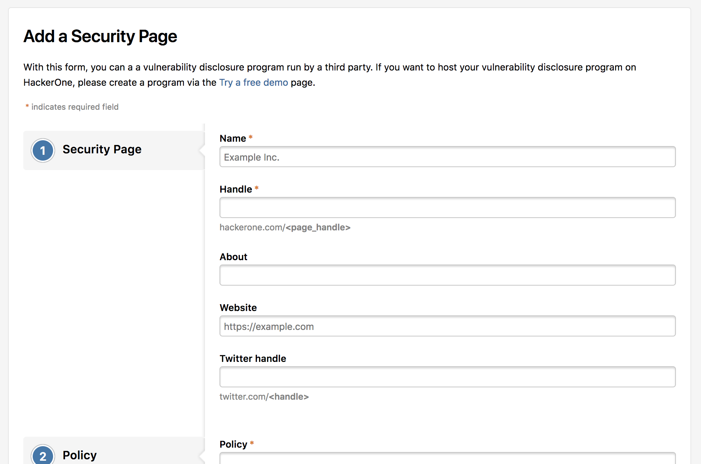

As the directory doesn’t contain every single organization, hackers with a reputation of at least 1000 are able to create directory profiles for external organizations.

In order to create a directory entry:
1. Search the [directory](https://hackerone.com/directory) to see whether the organization already has an existing directory page.
2. Click <b>Submit a program</b> if no matching entry exists.

><i><b>Note:</b> Only hackers with a reputation of at least 1000 will be able to see this button and create a page.</i>

3. Enter information about the organization on the <b>Add a Security Page</b>.

4. Click <b>Submit Program</b>.

Programs will be visible on the directory as soon as the directory is created.  When an employee of the organization chooses to own and manage the profile, they can [submit a claim](/programs/security-page.html).
