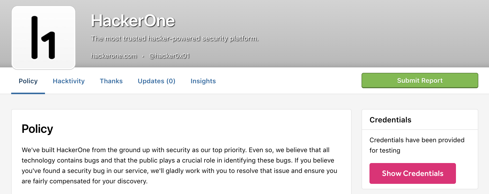

Some programs require you to have special access credentials in order to hack on certain assets. These credentials can be shared with you via a representative from HackerOne, or you can retrieve the credentials from the security page of programs using the [credential management](/organizations/credential-management.html) feature.

To access credentials for programs using credential management:
1. Go to the program's security page.
2. Click <b>Show Credentials</b> in the Credentials section.

3. Create an account using the credentials provided.

4. Enter the username of the account you created.
5. Click <b>Save</b>.
