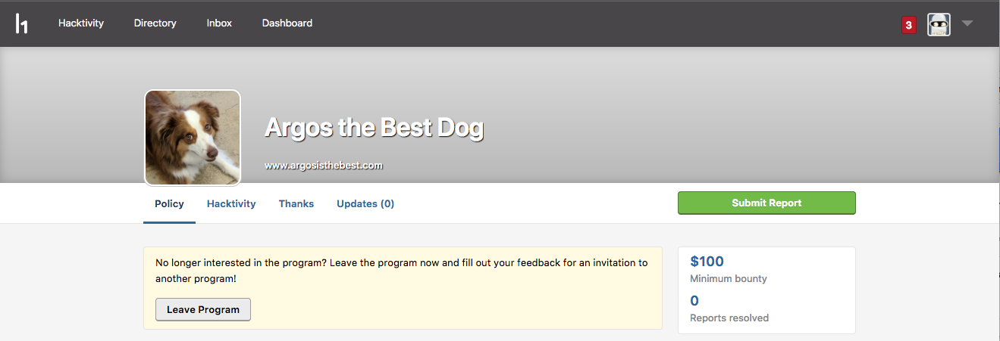
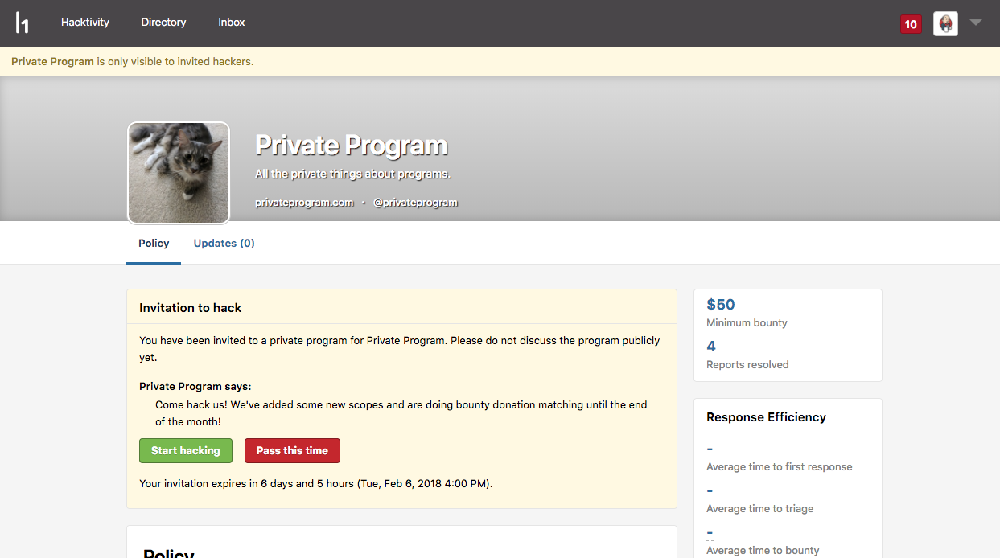
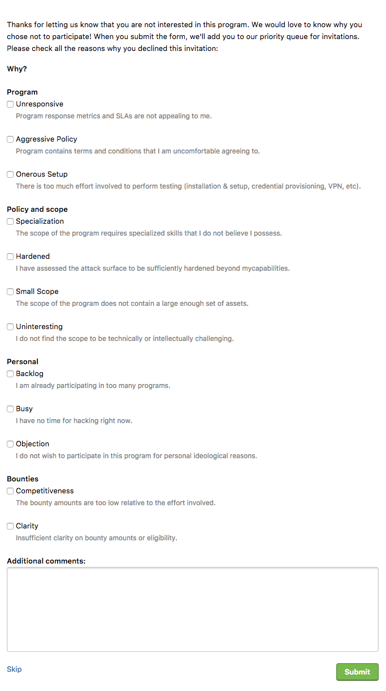

There are times where you don't want to accept a program or even after accepting, you decide to leave. Upon leaving a program or declining an invitation, you'll be given an opportunity to fill out a questionnaire with your reasons about declining an invitation or leaving the program.

### Declining an Invitation
When you decline an invitation to a private program, you'll have the option to fill out a rejection questionnaire to share your feedback with HackerOne.

At HackerOne we believe in transparency, and in this case, it includes giving programs the reason why hackers aren't interested in engaging with them. Your feedback will help programs understand why hackers don't want to participate in their programs and can better help them to modify their programs so that hackers will want to hack in them.

### Leaving a Program
Sometimes after looking into a program, you realize it’s not a program you’re interested in participating in. You have the option to leave a program. The **Leave Program** button will appear on the security page of the program you want to leave. To leave the program, click **Leave Program**.

After selecting to leave the program, you'll get the option to fill out a questionnaire on why you've decided to leave the program. Filling out the questionnaire will put you as a priority for future invites. See: [Invitations Priority Queue](/hackers/invitations-priority-queue.html)

### The Feedback Questionnaire
To access the questionnaire, decline the invitation or leave the program and the questionnaire will directly appear on your screen.

><i>Note: You must fill out the questionnaire immediately. You can't save and come back to it later.</i>

The questionnaire is completely voluntary, but if you fill it out, you'll get priority for another invitation so that you can find a program that is a better fit.
