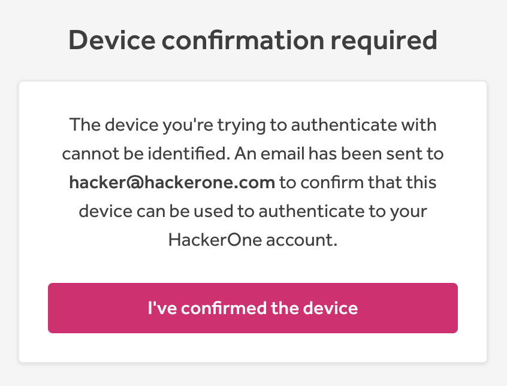
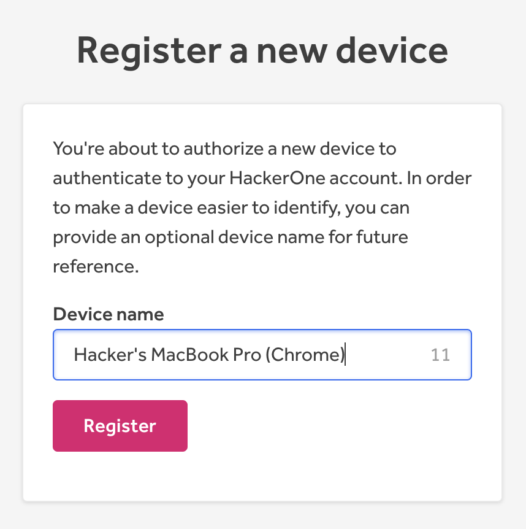
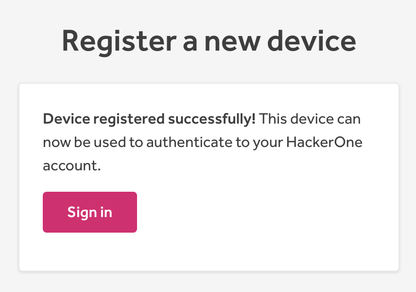
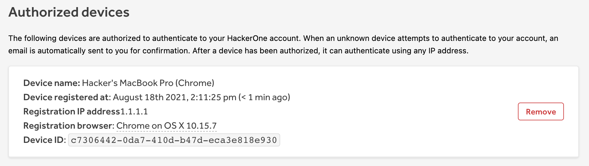

Device registration provides extra security to ensure that even if attackers acquire your account credentials, they will not be able to access your account at HackerOne. Only devices registered to you will be able to log in to your account. Each browser and device will require its own registration. A browser will only have to be registered once.

### Registering a Device

To register a device:

1. Start the login process as normal and you will see a pop-up requiring you to register your device. A message will be sent to your email address with the IP address, user agent, and date. The email must be opened from the same browser that you are registering. This email token will only last for 15 minutes and cannot be reused.

Note: If you receive one that is not your device, the attacker will be unable to access your account unless you approve. Changing your password is highly recommended. If you accidentally approve one of these, it will still not allow them to enter as the email must be opened from the same browser that you are registering.

2. Click **Authorize New Device** button. This will open a new tab for registering the new device.

3. Enter a Device Name (optional) - Example: Jane Doe’s MacBook (Safari)

4. Click **Register**.
    A screen will appear saying your device has been registered successfully and an email will be sent to your address confirming the registration.

5. Click **Sign In** and sign in as normal.

### Managing Devices

To manage your registered devices:

1. In the top right corner of your screen, click the dropdown next to your profile icon.

2. Click **Settings**

    * You will see a tab called **Account Security**. This was previously called **Authentication**. From here you can manage two-factor authentication settings, registered devices, and see all past and current sessions.

If you remove a device that’s no longer in use, any active sessions on that device will be ended right away and a device removed email will be sent to your email address.

If you try to log in with that device again, you will have to re-register it as you did before.
