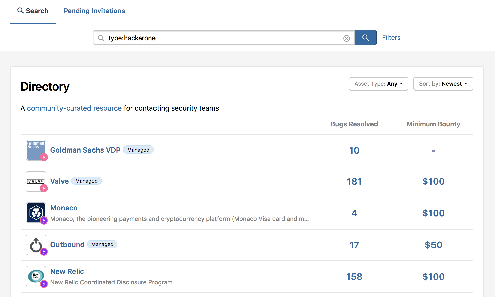
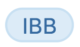
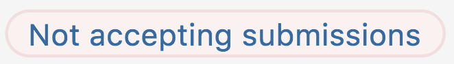

The Directory is a community-curated resource for contacting security teams. It identifies the best way to contact an organization's security team so that all hackers can report potential vulnerabilities directly to the organizations that can resolve them. The directory is comprised of a list of various organizations that both use and don't use HackerOne. It documents the existence of an organization's vulnerability disclosure policy and any associated bug bounty programs.

As HackerOne believes that all organizations who build technology should provide a safe process for vulnerability disclosure, the HackerOne Directory aids in providing a safer internet as it provides hackers with the ability to contact an organization with their found vulnerabilities.

### Directory Services
The Directory enables Hackers to:
* Share their disclosure experiences and add security team contact information to the Directory so others can benefit from their work.
* [Search the Directory](https://hackerone.com/directory) to get the contact information for an organization's security team.
* Find programs they're interested to hack on.

*Note: If an organization hasn't published security contact information anywhere, HackerOne recommends considering assistance from the [local CERT](https://www.first.org/members/teams/).*

The Directory enables programs to:
* Publish contact information for receiving information about potential vulnerabilities in their products or online services, such as a security@ email address or a HackerOne program. See [ISO 29147](http://www.iso.org/iso/catalogue_detail.htm?csnumber=45170) for additional guidance or [contact HackerOne](mailto:support@hackerone.com).
* [Search the Directory](https://hackerone.com/directory) for their organization to ensure that their security team's contact information and disclosure policy is accurate. 

### What's on the Directory
You can find this information associated with an organization on the directory:

Option | Detail
------ | ------
Bugs Resolved | The total number of vulnerabilities the organization has resolved. If the field is marked with a `-` this means that there are no resolved reports.
Minimum Bounty | The minimum bounty that will be given for a valid vulnerability. If the field is marked with a `-` this means that there is no minimum bounty.

As the directory contains various icons, refer to this table to understand the different icons associated with an organization:

Icon | Detail
---- | ------
IBB   | Indicates Internet Bug Bounty - a bug bounty program for core internet infrastructure and free open source software. These programs are managed by a panel of volunteers selected from the security community. Learn more [here](https://www.hackerone.com/internet-bug-bounty).
Managed    | A program that is managed by HackerOne. These programs are more likely to respond quickly to your report and there's a higher likelihood of being successful on these programs because it's managed by the HackerOne triage team. 
Not accepting submissions  | A program that isn't accepting any report submissions on HackerOne. 
Pink thunderbolt    | The program responds quickly to report submissions. There's a <48 hour first response time. 
Purple and pink thunderbolt    | The program responds quickly to report submissions and is also quick in awarding bounties. There's a <48 hour first response time and a <14 day time in awarding a bounties. 

### Using the Directory
You can search for organizations in the directory by searching for them in the search bar. You can also filter organizations by asset type and sort them by: 
* Newest
* Oldest
* Bounty Amount
* Number of bugs resolved
* Alphabetized name

### Correcting Information on the Directory
As the directory is community-curated, hackers who maintain sufficient reputation have edit rights and can update information about an organization, or you can reach a moderator at directory@hackerone.com with any changes. 
