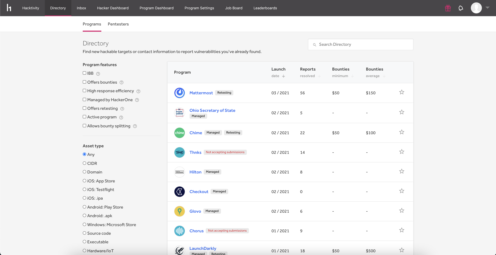

The Directory is a community-curated resource that helps hackers identify the best way to contact an organization's security team. This guides hackers with reporting potential vulnerabilities directly to the organizations that can resolve them. The Directory is comprised of a list of various organizations that both use and don't use HackerOne. It documents the existence of an organization's vulnerability disclosure policy and any associated bug bounty programs.

### Directory Services
The Directory provides relevant information for both hackers and programs.

The Directory enables Hackers to:
* [Search](https://hackerone.com/directory) for an organization to get the contact information of a security team.
* Add security team contact information for an organization so that other hackers know where to submit vulnerabilities (See [Create a Directory Page](/hackers/create-a-directory-page.html))
   * As the directory is community-curated, hackers who maintain sufficient reputation have edit rights and can update information about an organization.  If you don’t have edit rights, you can reach a moderator at directory@hackerone.com with any changes.
* Find programs they're interested to hack on
* Bookmark their favorite programs  
* View and compare statistics of various programs

><i>Note: If an organization hasn't published security contact information anywhere, HackerOne recommends considering assistance from the [local CERT](https://www.first.org/members/teams/).</i>

The Directory enables programs to:
* Publish contact information for receiving information about potential vulnerabilities in their products or online services, such as a security@ email address or a HackerOne program (See [ISO 29147](http://www.iso.org/iso/catalogue_detail.htm?csnumber=45170) for additional guidance or [contact HackerOne](mailto:support@hackerone.com))
* [Search](https://hackerone.com/directory) for their organization to ensure that their security team's contact information and disclosure policy is accurate (See [Claiming the Security Page](/organizations/security-page.html) if the program page hasn’t been claimed for editing)

### What's on the Directory
You can find this information associated with an organization on the directory:

Information | Details
------ | ------
Launch date | The date the program started to accept vulnerabilities.
Reports resolved | The total number of vulnerabilities the organization has resolved. If the field is marked with a `-` this means that there are no resolved reports, or the program chose not to display this information on their metric display settings.
Bounties minimum | The minimum bounty that will be given for a valid vulnerability. If the field is marked with a `-` this means that there is no minimum bounty, or the program chose not to display this information on their metric display settings.
Bounties average | The average bounty that is given for a valid vulnerability in a program. If the field is marked with a `-` this means that there is no average bounty, or the program chose not to display this information on their metric display settings.
Star Icon  | Bookmark your favorite programs by clicking on the icon. A list of your bookmarked programs will show on your [Hacker Dashboard](/hackers/hacker-dashboard.html) under the **Bookmarked Programs** tab.
Managed label  | Shows that the program is managed by HackerOne. These programs are more likely to respond quickly to your report and there's a higher likelihood of being successful on these programs because it's managed by the HackerOne triage team.
Not Accepting Submissions label  | Shows that the program isn’t currently accepting any report submissions on HackerOne.
Collaboration label| Shows that the program enables hackers to collaborate with others and split their bounty in finding and submitting a vulnerability.
Retesting label | Shows that the program participates in [retesting](/hackers/retesting.html).

### Directory Filters
You can filter your list of programs by both program features and by asset type.

The program features you can filter include:

Filter | Details
------ | ------
IBB | Indicates Internet Bug Bounty - a bug bounty program for core internet infrastructure and free open source software. These programs are managed by a panel of volunteers selected from the security community. Learn more [here](https://www.hackerone.com/internet-bug-bounty).
Offers bounties | Programs that offer bounties as rewards for finding vulnerabilities.
High response efficiency | Programs that meet their [response target metrics](/organizations/response-target-metrics.html) at least 80% of the time.
Managed by HackerOne| Programs managed by HackerOne. These programs are more likely to respond quickly to your report and there's a higher likelihood of being successful on these programs because it's managed by the HackerOne triage team.
Offers retesting | Programs that can request hackers to [retest](/hackers/retesting.html) vulnerabilities.
Active Program | Programs that are currently accepting report submissions.
Bounty spitting | Programs that enable hackers to collaborate with others in submitting a vulnerability.
