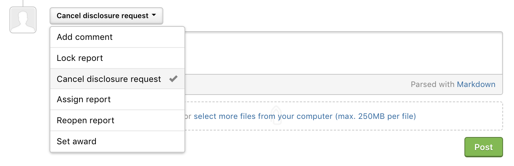

Disclosure enables programs to be transparent about the security vulnerabilities found for their program. HackerOne's disclosure process balances transparency with control over what information is shared.  

Programs can choose from 3 disclosure settings:

Option | Detail
------ | -------
Disclosure | You or the security team can request disclosure for any closed report in the program. If the admin of your program agrees to disclosure, the contents of the report will be made public. Upon requesting disclosure, if the report is neither approved or denied, reports in the Resolved state will automatically default to disclosure where the contents of the report will be auto-disclosed within 30 days.   *This is the default setting for all verified programs*.  Note: Reports must be in the Resolved state to default to disclosure. Any other [report state](/hackers/report-states.html) requires mutual agreement.
Disclosure requiring Mutual Agreement | You can request disclosure for any closed report in the program. If the program security team agrees to disclosure, the contents of the report will be made public. If the security team doesn't take any action, the contents of the report will remain private.   *The program must request to opt-in to this option.*
Disclosure Disabled | Disclosure isn't allowed for any report.

### Requesting Disclosure

Both you and program members can request for disclosure. To request for disclosure:
1. Go to the report you want to disclose.
2. Make sure the report is closed.
3. Select **Request disclosure** in the action picker at the bottom of the report.

4. Select whether you want to disclose the **Full** report or a **Limited** version.

Option | Details
------ | -------
Full | Upon disclosure, the full contents of the report are visible including the:<ul><li>Vulnerability information</li><li>Summary</li><li>Timeline (this includes comments and attachments)</li></ul>*Note: Internal comments are hidden.*  
Limited | Only the summary and timeline of the activity are visible. All comments and attachments are hidden. Limited disclosure allows for greater control over sensitive or extraneous information.

5. *(Optional)* Enter a comment to describe your reasons for disclosure.
6. Click **Post**.    

After public disclosure has been requested, the admin of the of the program can choose to publicly disclose the report. They can select **Disclose** to disclose the report and also change the disclosure options to Full or Limited.

When publishing reports, the security team can choose to disclose the report in full or limit the information published. The default is to display all the communication between the hacker and the security team from first report to resolution.

### Canceling Disclosure Requests

You can cancel your disclosure request if you later decide to not disclose your report. You can also cancel disclosure requests from a program asking you for disclosure.

To cancel a disclosure request:
1. Go to the report that has been requested for disclosure.
2. Select **Cancel disclosure request** in the action picker at the bottom of the report.

3. Enter a comment explaining why you are canceling the disclosure request.
4. Click **Post**.

### Disclosure for Private Programs

Private programs can also enable you to disclose a report to other hackers within the program. Upon disclosure, contents of the report will only be visible to other hackers in the private program. This enables you and other hackers to share your vulnerability findings with other hackers in the program so that they can be aware of what vulnerabilities have been found for that program.

You can request for disclosure in the private program you're a part of by following the same steps in the Requesting Disclosure section above.

When requesting to disclose the Full or Limited report, the options will only be specific to disclosing within that specific private program you're participating in:

Option | Details
------ | -------
Full | Upon disclosure, the contents of the report will be visible to other hackers in the private program.
Limited | Only the summary and timeline of activity will be visible to other hackers in the private program.

For more information, please read the full [HackerOne Disclosure Guidelines](https://hackerone.com/disclosure-guidelines). If disclosure was accidentally initiated or you have concerns about this process, please [submit a support request](https://support.hackerone.com/hc/en-us/requests/new).
