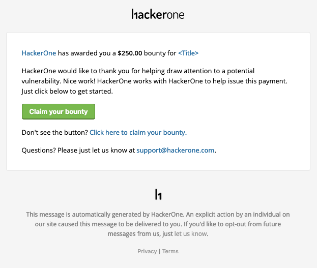
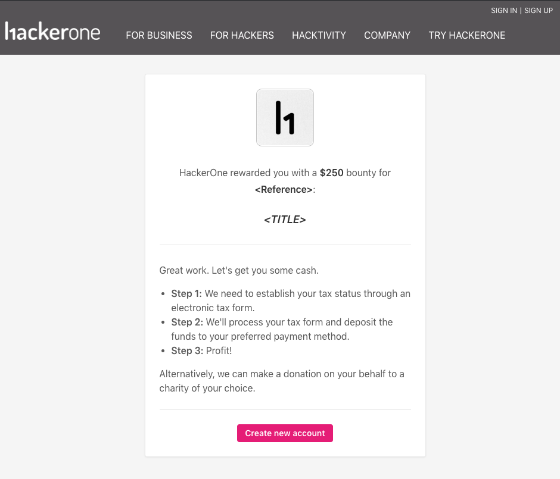
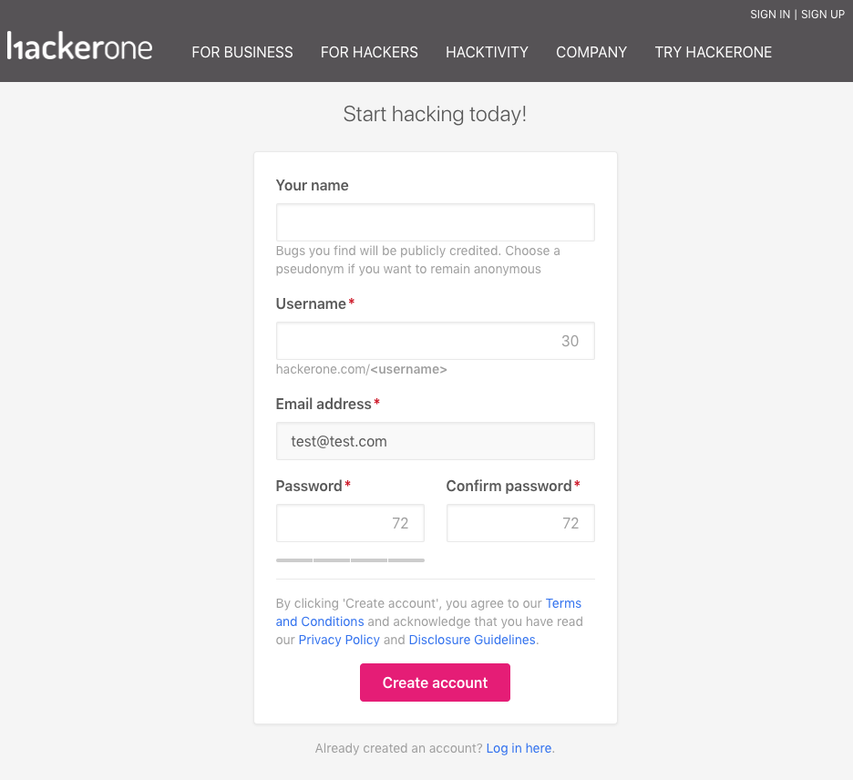
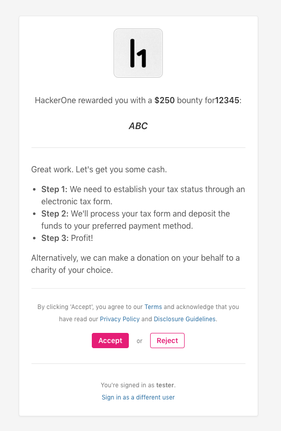
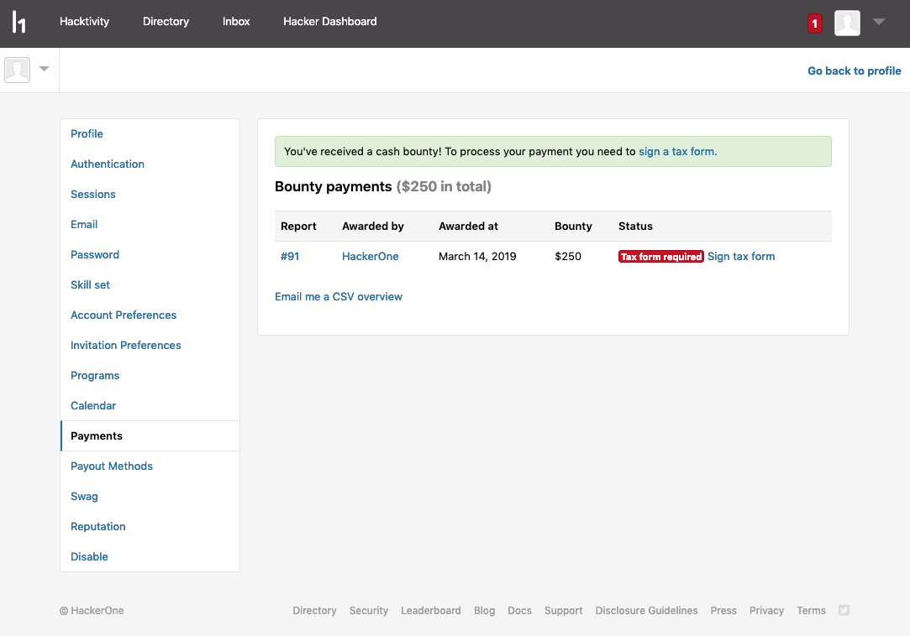
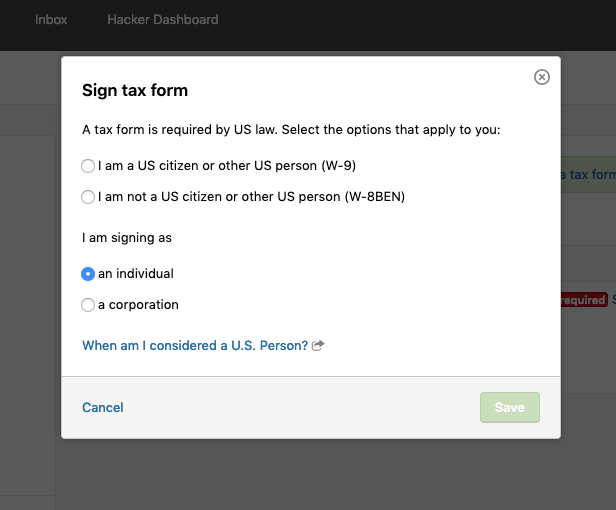
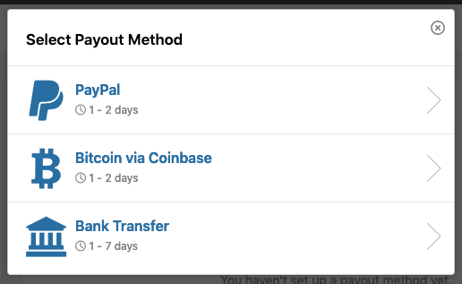

If you're a hacker that submitted a valid vulnerability to a private program you're not a part of, or if you're a hacker without a HackerOne account, you can still receive bounties for your valid vulnerabilities.

To receive your bounty as an external hacker:
1. Click **Claim your bounty** in the bounty notification email.

2. Review the bounty invitation. If there isn't an account associated with your email address, you'll be prompted to create a new account.

3. Sign up for a HackerOne account.

4. Choose to accept or reject the bounty.

5. Click **Sign tax form** on your bounty settings page.

6. Fill out the tax form.

You'll be sent a HelloSign tax form to fill out, and once it's complete, it'll go through a review process. The review process will take about 24 hours, and once that's complete, you'll receive an email notification and will be able to choose your default payment method.

After you set your payout preference, the payment will be sent to your account.
