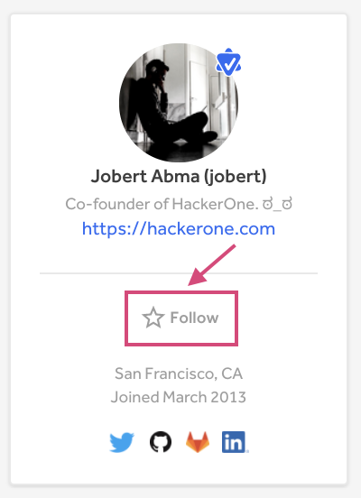
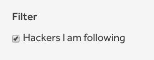
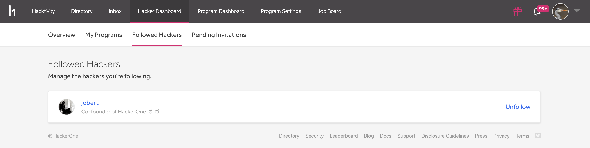

Hacker Following enables you to to keep up-to-date with your favorite hackers as you can see their activity on HackerOne.

To follow a hacker:
1. Go to the hacker’s profile page.
2. Click **Follow**.

*Follow* will change to *Following* to denote that you’re following the hacker.

### Filtering out Followers
To solely view the activity of the hackers you’re following on Hacktivity, select the **Hackers I am following** filter.

### Managing Followed Hackers
To manage all of the hackers you’re following:
1. Go to Hacker Dashboard > Followed Hackers.
2. *(Optional)* Click **Unfollow** to stop following any hackers you no longer wish to keep track of.

