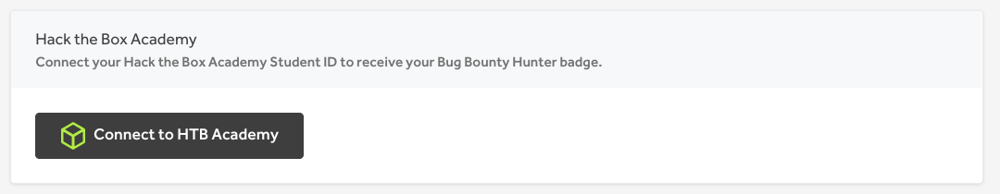
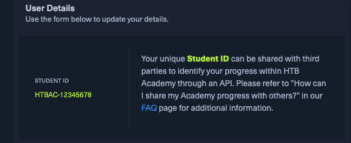

# Hack The Box

You can connect your Hack the Box Academy account to HackerOne on the [External Services profile settings page](http://hackerone.com/settings/external_services/edit)
using your Hack the Box Academy **Student ID**:

You can generate the **Student ID** in your [Hack the Box Academy Settings](https://academy.hackthebox.com/settings):

