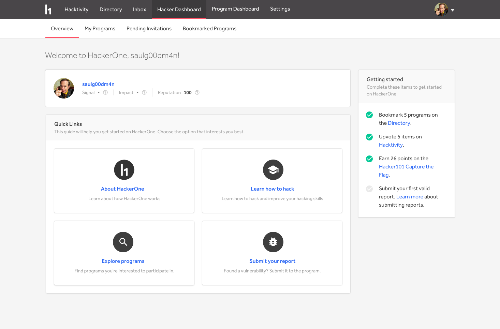
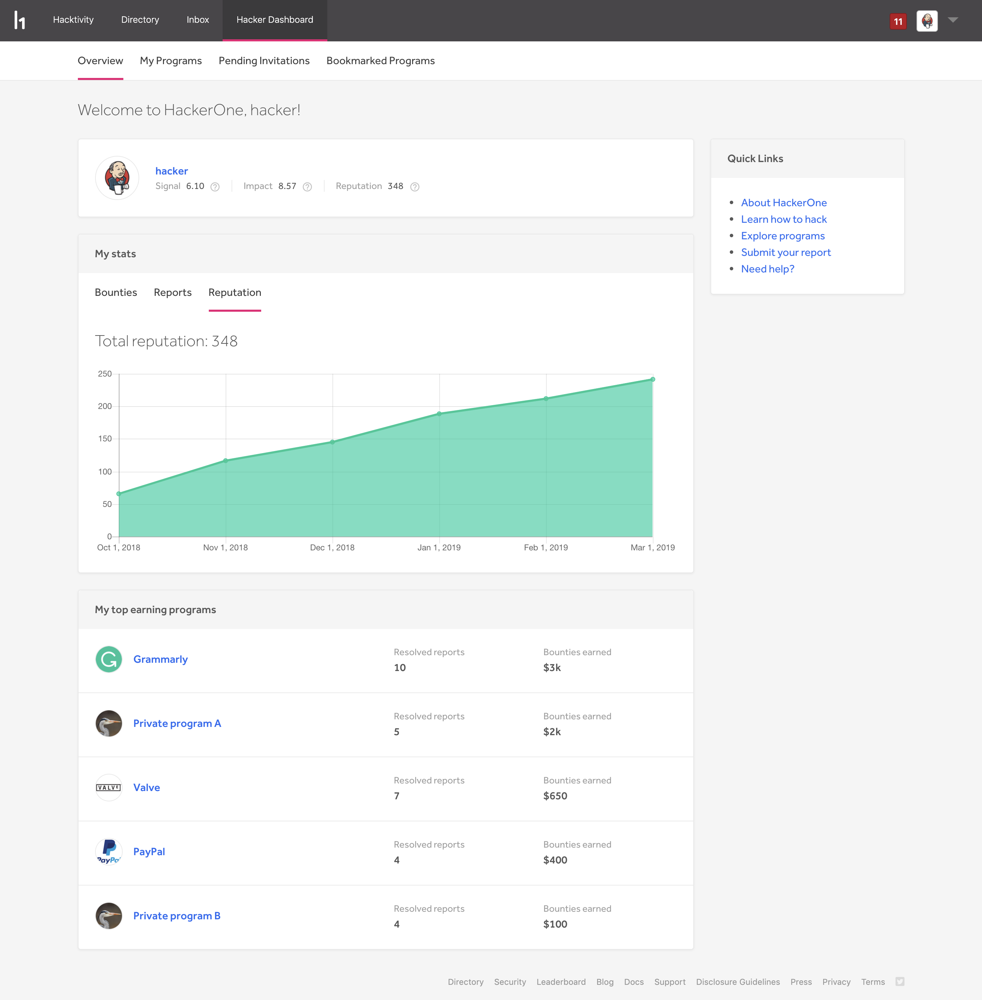
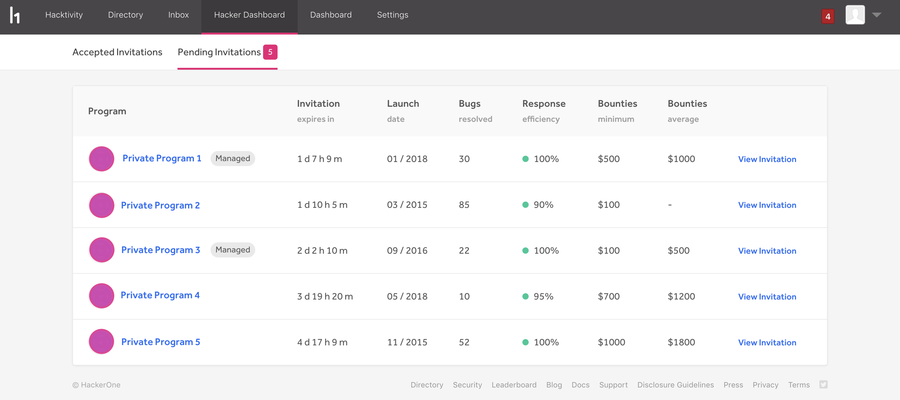
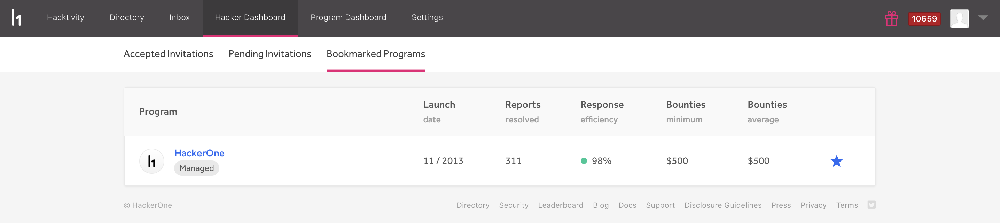

The Hacker Dashboard enables you to view and manage all of your invitations.

### Overview

The Overview page is your guide to help you get started on HackerOne. You'll be directed to the right pages to help you get the information you need to successfully start out on HackerOne.

We also provide you with a getting started checklist with 4 tasks to complete. Completion of the tasks will help guide you to be more successful on the platform.

After you've submitted your first vulnerability, you'll be able to keep track of your statistics regarding the amount of bounties you've earned, the number of reports you've submitted, and your reputation. You can also view your top earning programs.

### My Programs

> <i>**Note:** We moved the _My Programs_ page to [Opportunities](/hackers/opportunity-discovery).</i>

### Pending Invitations

The Pending Invitations tab enables you to view all of the invitations that you haven’t accepted.

For each program you have an invite to, you can view these options:

Option | Detail
------ | -------
Invitation Expiration Time | Invitations don't last forever! They have an expiration time where you can no longer take action to accept them.
Launch Date | The date the program started to accept vulnerabilities.
Bugs resolved | The total number of vulnerabilities the program has fixed.
[Response Efficiency](/organizations/response-target-indicators.html) | The percentage of reports that are responded to on time within the last 90 days.
Minimum Bounty | The minimum bounty that will be given for a valid vulnerability. If the field is marked with a `-` this means that there is no minimum bounty, or the program chose not to display this information on their metric display settings.
Average Bounty | The average bounty that will be given for a valid vulnerability. If the field is marked with a `-` this means that there is no average bounty, or the program chose not to display this information on their metric display settings.

Click <b>View Invitation</b> to review the invitation and take action to accept or reject it.

### Bookmarked Programs

The Bookmarked Programs tab enables you to view the list of programs that you've marked as your favorites in the directory. This enables you to better keep track of the programs you're most interested in.

To remove programs from your bookmarked list, click the blue star icon.
