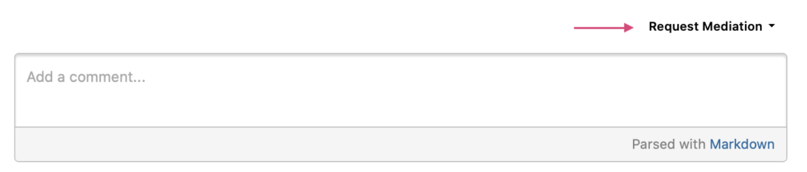
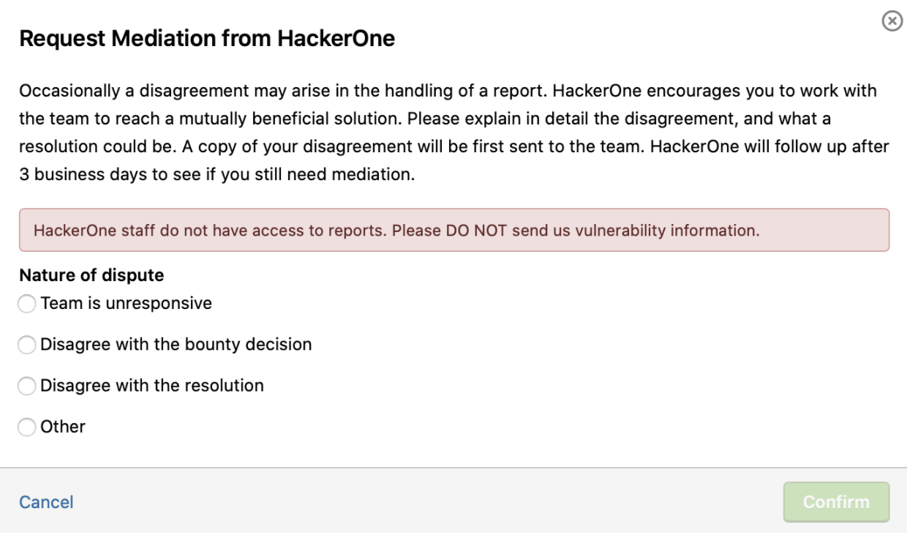

Hackers can request assistance from HackerOne in cases when discussions with the program have been attempted and there has been no satisfactory resolution. Vice versa, programs can also request mediation when the Code of Conduct has been violated. 

Hacker Mediation can be requested for the following reasons:
* A program's decision is inconsistent with broad industry standards.
* A program does not honor a commitment made on their Security Page.
  * A program promises to reply within a certain time period on their Security Page but fails to do so.
  * A program claims a domain is in scope on their Security Page, then makes a last-minute change to pull it out of scope based on your report.
  * A program clearly outlines a vulnerability in a particular domain as being worth a minimum bounty, but then awards less than that amount or no bounty at all without explanation.
  * Etc.

Hacker mediation is used to raise concerns about reports to security teams and facilitate discussions between hackers and customers to enable a more favorable outcome for everyone involved. Please keep in mind that if a program is not managed or triaged by HackerOne, then the time to fully resolve the mediation might take longer than usual. Mediation also cannot be requested for basic programs.

>Note: HackerOne does not accept Mediation requests for [Disclosure Assistance](https://hackerone.com/disclosure-assistance?type=team) reports(linked) or Basic Programs that are not managed by HackerOne.

### Requesting Hacker Mediation
To request mediation:
* Open the report you'd like to request HackerOne mediation support for.
* Scroll to the bottom of the report.
* Click **Request Mediation**.

* Select the Nature of dispute in the Request Mediation form.
* Click **Confirm**. This will trigger a workflow to reach out to both the program and the relevant hacker.

When providing information about the mediation, please be as descriptive as possible about the nature of the disagreement. If no information is provided in the mediation request, this will increase the mediation response time as the mediation team will have to take time to make sure they understand the context to provide the proper assistance. Mediation is here to support. Please be advised that for programs not Triaged by HackerOne, Mediation may need extra time to work with the program to be granted access.

>Note: Please don't share excessive report details with HackerOne in the initial request without explicit mutual agreement from the program. HackerOne will arrange it with the program's security team if more information is required to address the problem.

Please do not request mediation for the following reasons (these requests will be closed):
* If the report has been closed for 3+ months. HackerOne will not be able to mediate for reports that have been closed for over 3 months.
* If you are looking for an update on a report which has seen an update from the H1 Triage team or program team less than 7 days ago
* If your reason for request does not contain enough information about how we can assist or why you disagree with the handling of a report. Provide substantial context in your request

Please respect the guidelines above and only request mediation if it's deemed absolutely necessary. Abuse of the hacker mediation process will result in this privilege being revoked from your account.

Finally, keep in mind that HackerOne is no longer able to add external researchers to original report submissions due to security and privacy concerns related to doing so.

### Hacker Mediation Triggers
Requesting hacker mediation triggers the following actions:
* An email is sent to the program's security team, requesting that they make their best effort to resolve the issue with the hacker within 3 business days.
* If the security team doesn't respond to the hacker or if the situation isn't resolved, HackerOne will evaluate all available information about the vulnerability report, the hacker who requested mediation, and the organization to determine the appropriate level of escalation.
* HackerOne’s Customer Success team will escalate certain concerns to program teams and engage closely to encourage a favorable outcome if, in HackerOne's judgment, the hacker's case warrants it.
* If the security team is unable to respond to the hacker or if the situation is not promptly resolved, The Mediation team will contact all involved parties and work together with the hacker and program teams to gain an appropriate and timely outcome.

**Mediation Requests vs Support Requests**

Mediation requests are different from Support requests. When requesting mediation, it’s important that you request for the right reasons, as some issues are best taken to HackerOne Support instead. Here’s a table to help you see the difference between the type of requests:

Support Request | Mediation Request
----------------- | ---------------
Request help with a payment that didn’t go through | Bounty disagreement (e.g.: The bounty table specifies a different amount that the one awarded for this criticality)
Request credentials for a program | Resolution disagreement (e.g.: The bug was marked as duplicate and the “original” report has an older report number)
Two-factor authentication resets | Unresponsiveness (e.g.: The triage team or the program provided no updates for a week)
Account deletion |
General questions |

>Note: Please do not perform testing on the Request Mediation feature on reports. Doing so will result in an outreach from the Mediation team to cease testing.

### The Make It Right Fund
There may be cases where HackerOne may believe a hacker’s submission has been handled incorrectly. We want to make sure hackers are awarded for their efforts in such cases. After extensive backend reviews are completed of the specific report, the hacker may be considered for a discretionary correction from the HackerOne Make It Right Fund. Please keep in mind that not every report is eligible for Make It Right and the decision to recommend or consider a Make It Right award belongs to HackerOne. Usage of Make It Right may be noted in the report’s record for transparency.
