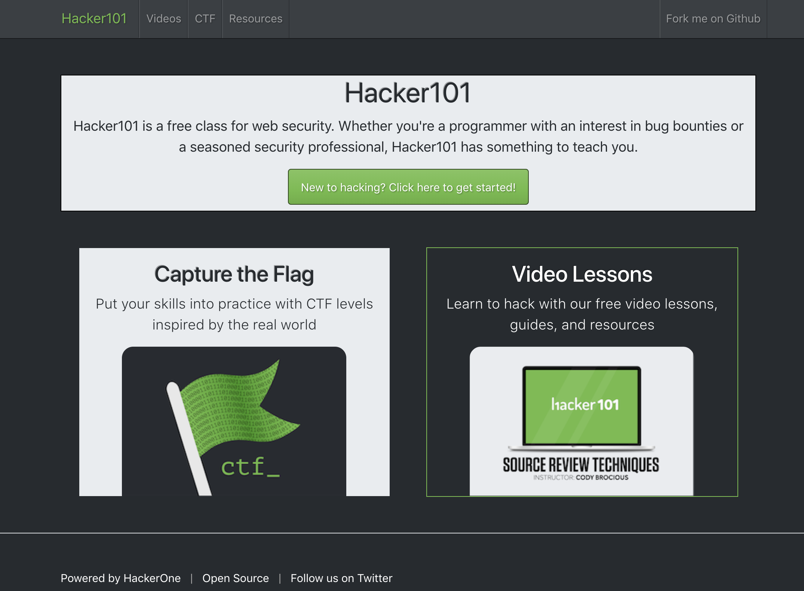
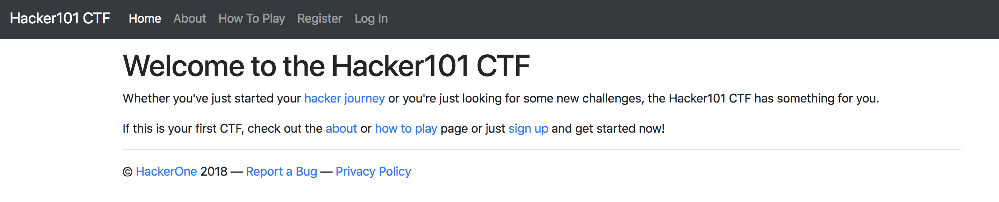
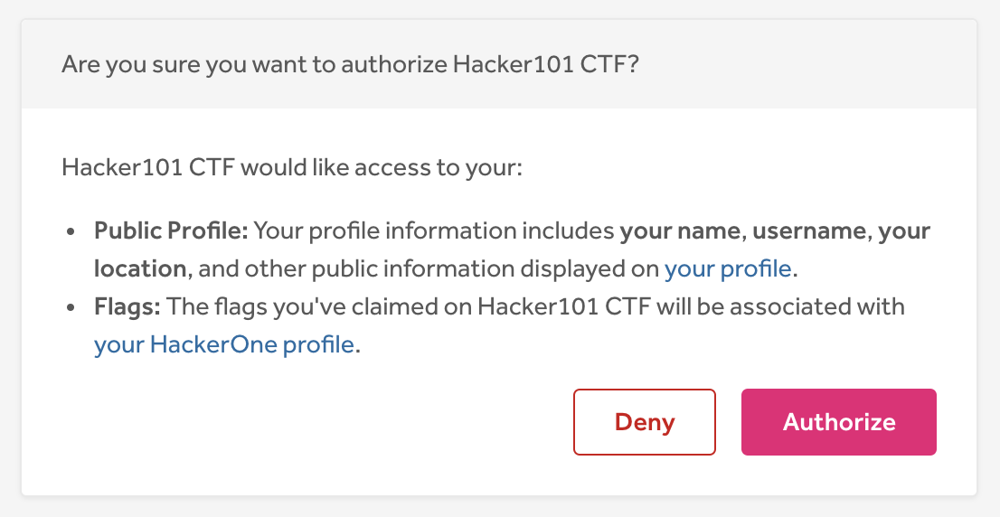
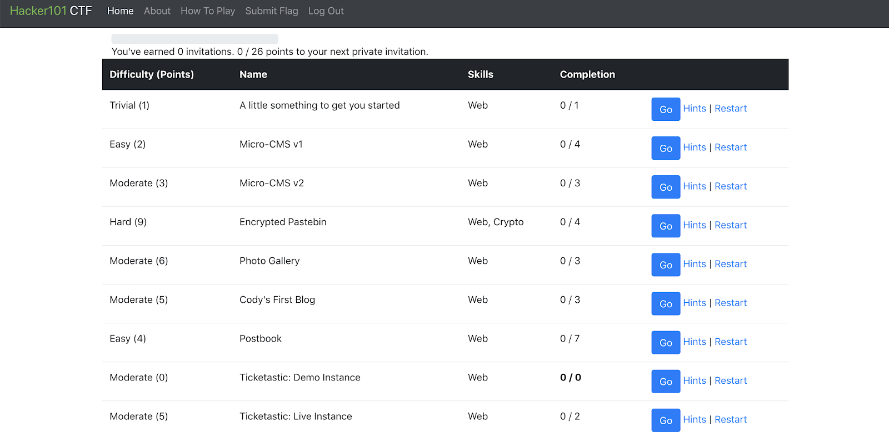
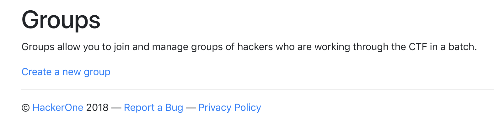
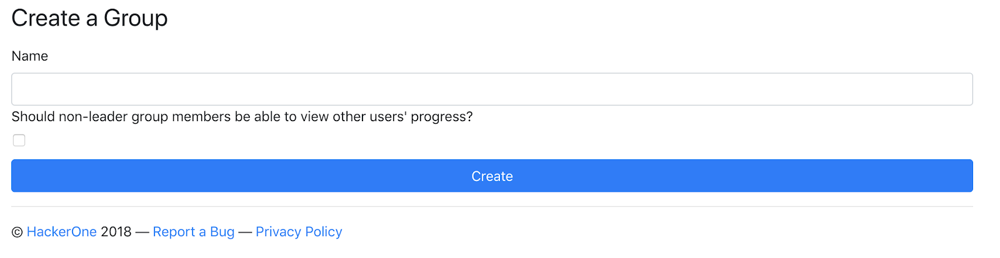

Need to learn the basics of hacking? HackerOne offers Hacker101 - a free online course about web security. The course is taught through video lessons where you don't have to go through the course in order, but you can simply watch the lessons on the topics that you want to learn about.

The course offers a range of topics you can learn about. They range from writing reports, setting up Burp proxy, cookie security, to clickjacking and crypto attacks. Go to https://www.hacker101.com/ to access all the course material.

You can view the FAQ list at https://www.hackerone.com/hacker101 or email hacker101@hackerone.com with questions or comments.

### Hacker101 CTF
Hacker 101 also offers a Capture The Flag (CTF) game where you can hack and hunt for bugs in a safe environment. The CTF serves as the official coursework for the class. You can still access the old coursework on the [github repo](https://github.com/Hacker0x01/Hacker101Coursework).

Every time you earn 26 points in the CTF, you’ll be put in the priority queue to receive invitations to private programs. Once you receive and accept an invitation to a private program, you’ll be taken out of the priority queue until you earn another 26 points to be put back in the queue.  

To get started on the Hacker101 CTF:
1. Log in with your HackerOne account. <i>Note: You need to have a HackerOne account to log in to the Hacker101 CTF. If you don’t have a HackerOne account, click Log in and you can get started with creating one.</i>

2. Authorize Hacker101 CTF to access your HackerOne public profile and flags.

3. Select the difficulty of the level that you want to find flags for.

4. Click <b>Go</b> to start capturing flags.

If you get stuck, you can select <b>Hints</b> to receive a hint. Keep in mind that most levels have a total of 3-5 hints, and hints can only be accessed on an increasing timer, as the time before accessing each subsequent hint increases.

Click <b>Restart</b> if your instance is bugging out or running slow. You won’t lose any of your captured flags for clicking Restart.

#### Groups
You can also create your own group and invite others to join your group, through which you can manage individuals and their progress in working through the CTF.

Learn more about [Hacker101 CTF](https://ctf.hacker101.com/)
