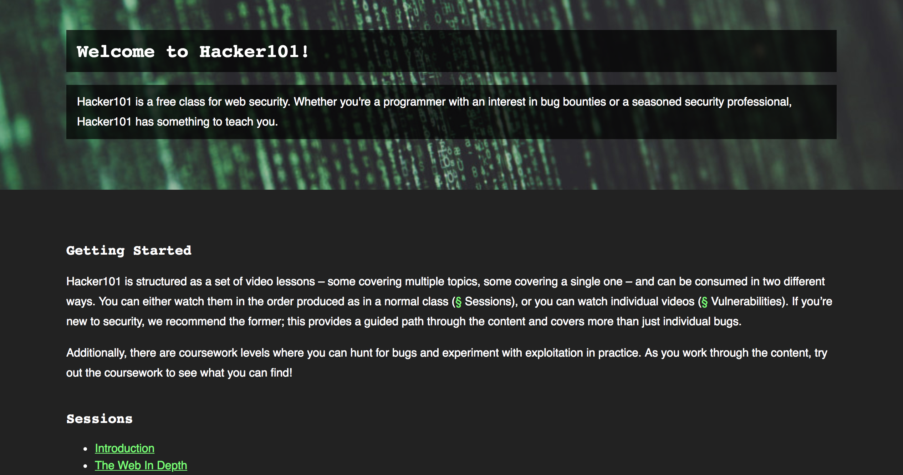

Need to learn the basics of hacking? HackerOne offers Hacker101 - a free online course about web security. The course is taught through video lessons where you don't have to go through the course in order, but you can simply watch the lessons on the topics that you want to learn about.

The course offers a range of topics you can learn about. They range from writing reports, setting up Burp proxy, cookie security, to clickjacking and crypto attacks. Go to https://www.hacker101.com/ to access all the course material.

You can view the FAQ list at https://www.hackerone.com/hacker101 or email hacker101@hackerone.com with questions or comments.

### Hacker101 CTF
Hacker 101 also offers a Capture The Flag (CTF) game where you can hack and hunt for bugs in a safe environment. The CTF serves as the official coursework for the class. You can still access the old coursework on the [github repo](https://github.com/Hacker0x01/Hacker101Coursework).

Learn more about the Hacker101 CTF [here](https://ctf.hacker101.com/).

 
