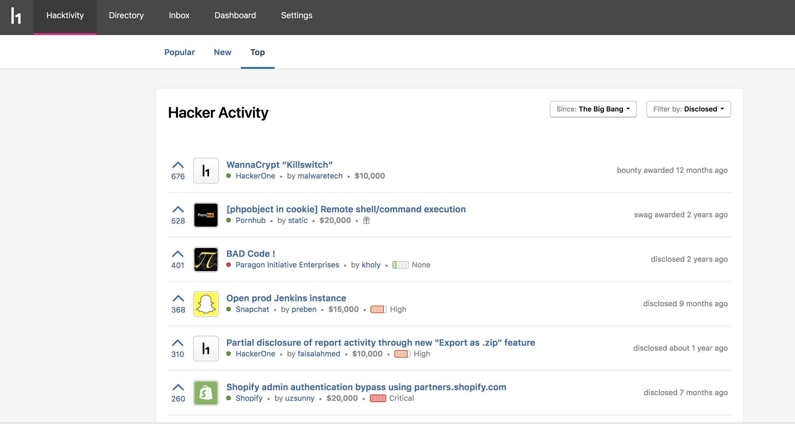
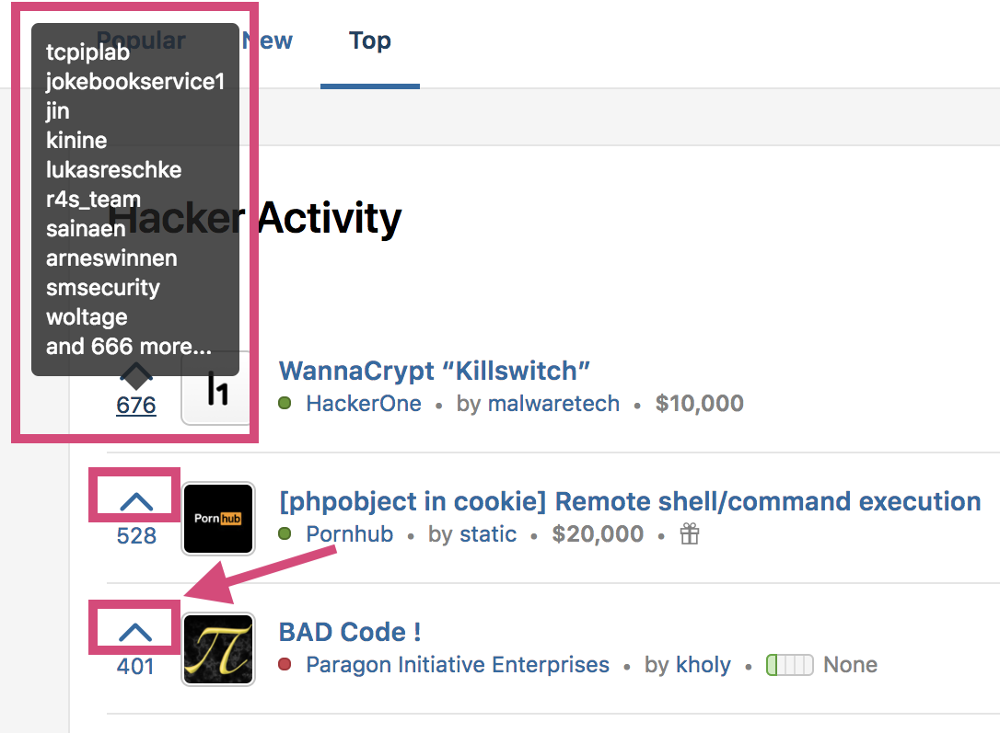

[Hacktivity](https://hackerone.com/hacktivity?sort_type=popular&filter=type%3Aall&page=1&range=forever) is HackerOne's community feed that showcases hacker activity on HackerOne. You can view:
* Reports of disclosed vulnerabilities
* The hacker that submitted the vulnerability
* The associated program
* The awarded bounty amount

There are 2 pages to Hacktivity:
* Popular - the activity that is currently trending
* New - the latest activity

### How Does an Activity Appear on Hacktivity?
Hacktivity only showcases activity for public programs. Hacker activity populates on the Hacktivity feed when disclosed and undisclosed reports are marked as:
* Closed
* Disclosed
* Bounty awarded
* Swag awarded

*Note: Undisclosed reports appear with a redacted title.*

### Upvoting
You can upvote hacker activities that you find interesting by clicking on the arrow next to the activity. Your upvotes help members of the platform discover what the most popular hacker activities are. Anyone with an account can upvote, but you can only upvote once on each activity. When you hover over the upvote count, you can see the top 10 hackers (ranked by Signal) that voted on the activity.

There is currently no downvoting capability, but you can retract your upvote by clicking on the arrow again.

### How is Activity Ranked on Hacktivity?
Activities on each page are ranked differently.

On the **Popular** page, vulnerabilities are ranked primarily by their aggregated upvotes. The vote is weighted slightly more if it comes from a hacker with high Signal. Additionally, each activity gets an initial boost if it is resolved and/or receives an above average bounty.

On the **New** page, activities are ordered chronologically with the latest activity being listed on top. A previously appeared vulnerability goes back to the top when there is new activity on the report.

If you want to see downvoting, a commenting feature, or a new feature request, send [HackerOne a feature request](mailto:feedback@hackerone.com).
