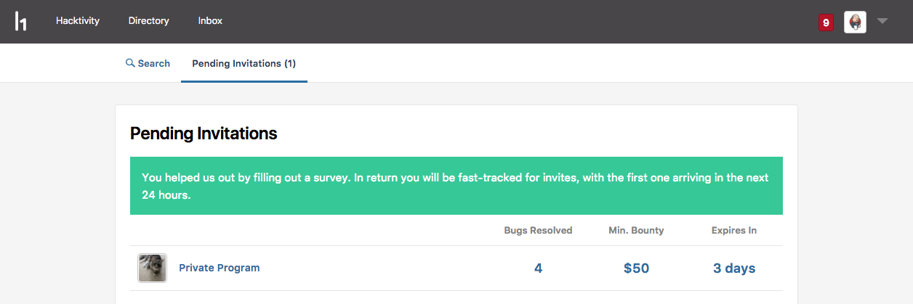
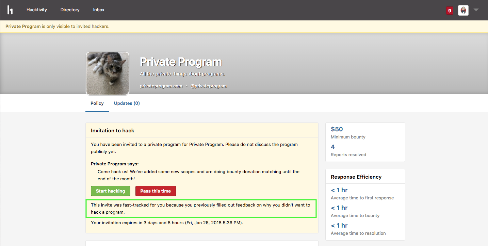

When you decline an invitation to a private program or leave a private program, you'll be placed at the top of the invitation queue for a new program invitation.

#### How It Works
To be placed in the invitations priority queue:
1. Decline an invitation or leave a program you're currently part of.
2. Fill out the questionnaire telling why the program wasn't a good fit. The questionnaire will immediately display on your screen after declining or leaving.

You'll see a green banner on your **Pending Invitations** page letting you know that you're slotted for the next appropriate invitation.

   

The timeframe for getting a new invitation is based on the number of programs looking for hackers, which is also dependent on the number of programs that have been rejected or left.
   

Some things to keep in mind are that: 
* You can only receive 1 priority invitation per day.
* For each original private invitation or program you decline, you have a total of 3 chances to receive a priority invitation that you like. You won't receive an invitation after you get your 3rd priority invitation for that original invitation or program you've declined.
