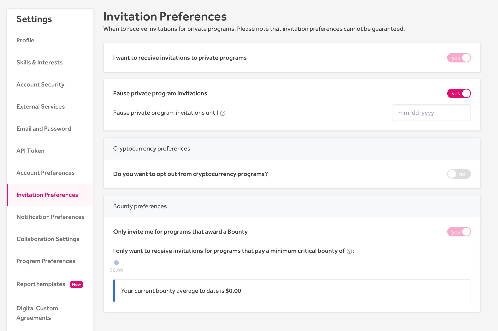

In order to hack on private programs, you must receive invitations to them. You can receive invitations if you meet the following criteria:
* Established [reputation](reputation.html)
* Non-negative [signal](signal-and-impact.html)
* Clear record with zero code of conduct violations

When your Reputation, Signal, and [Impact](signal-and-impact.html) are high enough, you'll join the pool of hackers that receive access to private programs. Once you start receiving invitations to those programs, remember, the one universal rule is to not talk about the private programs you're a part of.

HackerOne manages invitations for programs by:
* Daily checking to see if the program has met their report volume target in the last 30-days
* Inviting hackers for the program if they're not reaching their report volume target

### How Invitations Work
The number of invitations HackerOne sends is based on the program's report volume on a rolling 30-day basis. These are the use cases as to how HackerOne sends invitations:

Case | Action
---- | ------
The program is far from meeting their report volume. | HackerOne will gradually increase the number of invitations so the program can meet their report volume.
The program is receiving more reports while still being under their report volume. | HackerOne will send out fewer invitations.
The program's report volume is met. | Invitations will pause until the volume drops below the target in the 30 day window.
The program's report volume is set to 0. | No invitations will be sent.

Sometimes programs will manually invite you to hack on their programs. Keep in mind that it's a violation of Disclosure Guidelines for you to reach out to a private program in request for an invitation.

### Invitation Expirations
Invitations to hack a program expire in 1 week. You may want to reject an invitation for one reason or another. The sooner you let HackerOne know that you're not going to accept the invitation, the sooner the invite can be sent to another hacker.

### Invitation Preferences
Some hackers may want to get invites from any private program, while others only want invites from those offering bounties, and some may not want any invitations at all.

To choose when to receive invitations to private programs, you can navigate to **Settings > Invitation Preferences**.

You can choose from these options:

Field | Detail
------ | ------
I want to receive invitations to private programs | Select *yes* to receive invitations from private programs.
Pause private program invitations | Select *yes* to stop receiving invitations from private programs.
Pause private program invitations until | Enter the date you want to stop receiving invitations until.  
Cryptocurrency preferences | Select *yes* to opt-out from receiving cryptocurrency program invitations.   *This field is currently in beta*
Bounty preferences | Select *yes* to only receive invitations to programs that award a bounty.   *(Currently in beta)* Move the slider to indicate the minimum bounty amount for critical severity bugs for programs you’d like to receive invitations from.

