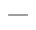
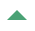
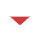

The HackerOne Leaderboards show which hackers are on top and where you personally stand in regard to different categories of leaderboards based on the selected time period.   

To view the leaderboards:
1. Log in to your HackerOne account.
2. Select **Leaderboards** in the top navigation.

Each hacker will have these visual progress markers to denote their movement trend on the leaderboards:

Marker | Details
------ | --------
 | The hacker hasn't moved on the leaderboard and has stayed in the same spot in the rankings.
 | The hacker has moved up in the rankings on the leaderboard.
 | The hacker has moved down in the rankings on the leaderboard.

The different leaderboards you can view include:

Leaderboard | Details
----------- | --------
Highest Reputation | The ranking is calculated based on reputation. The higher your reputation, the higher your ranking will be on the leaderboard.
Highest Critical Reputation | The ranking is based on reputation gain for high and critical submissions that are triaged or resolved. The higher your reputation from these submissions, the higher your ranking will be on the leaderboard.
OWASP | The ranking is based on reputation gain for triaged or resolved submissions within an OWASP 2017 category. The higher your reputation within that category, the higher your ranking will be on the leaderboard.   You can choose from these categories: <li>Broken Access Control <li>Broken Authentication <li>Injection <li>Insecure Deserialization <li>Security Misconfiguration <li>Sensitive Data Exposure <li>XSS <li>XXE
Country | The ranking is based on reputation gain. The higher your reputation in a country, the higher your ranking will be on the leaderboard for that country. You can choose different countries to see who’s on top in each country.   <i>**Note:** To see your ranking within your country, you need to opt-in to this leaderboard by selecting your country in your [profile settings](https://hackerone.com/settings/profile/edit).</i>
Up and Comers | The ranking is based on reputation gain from hackers that submitted their first valid report within the last 90 days.
Most Upvoted | The ranking is based on hackers with the highest number of report upvotes on Hacktivity. The higher the number of upvotes, the higher your ranking will be on the leaderboard.
CTF Talent | The ranking is based on the top hackers that gained the most points from the [Hacker101 Capture the Flag](hacker101.html#hacker101-ctf) challenges. 
