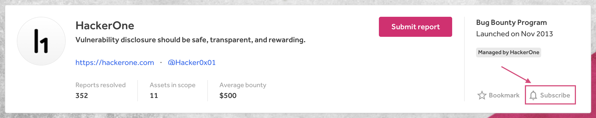
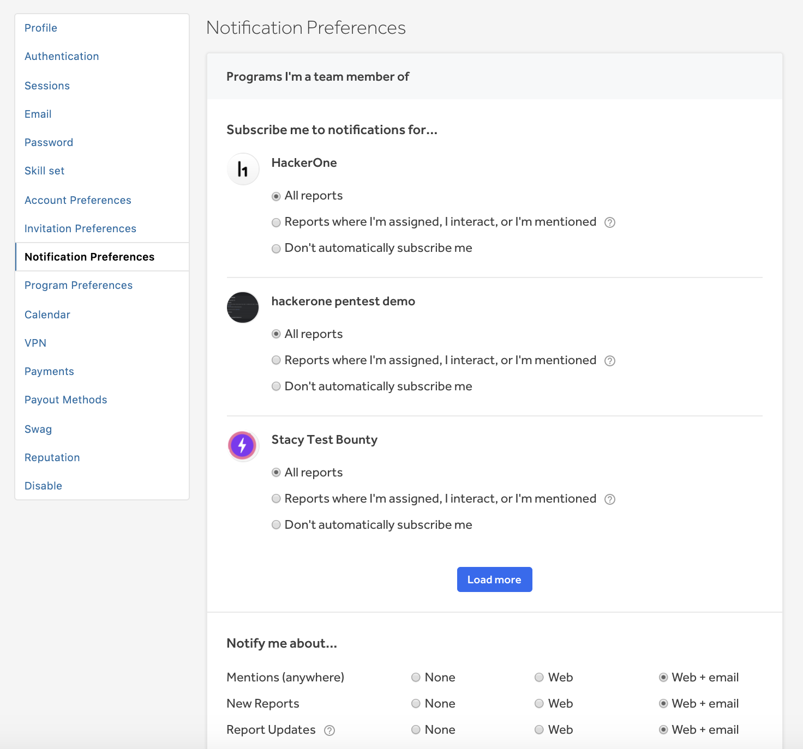

### Program Notifications
As a hacker, you’ll receive notifications (via the product and email) when programs you’re subscribed to make updates. Notifications in the product will appear in the notifications box next to your profile icon.

You can subscribe to receive program update notifications by subscribing to receive notifications via a program's Security Page by clicking **Subscribe**.

Updates to these program settings will trigger notifications:
* Policy
* Bounty table
* Scope
* Hacker messages

### Manage Notifications

#### Notification Preferences
You can manage your notification preferences on the Notification Preferences page under **Settings > Notification Preferences**.

