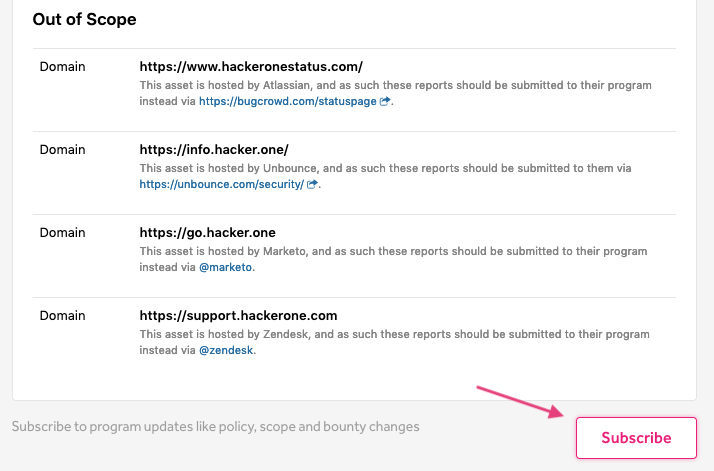
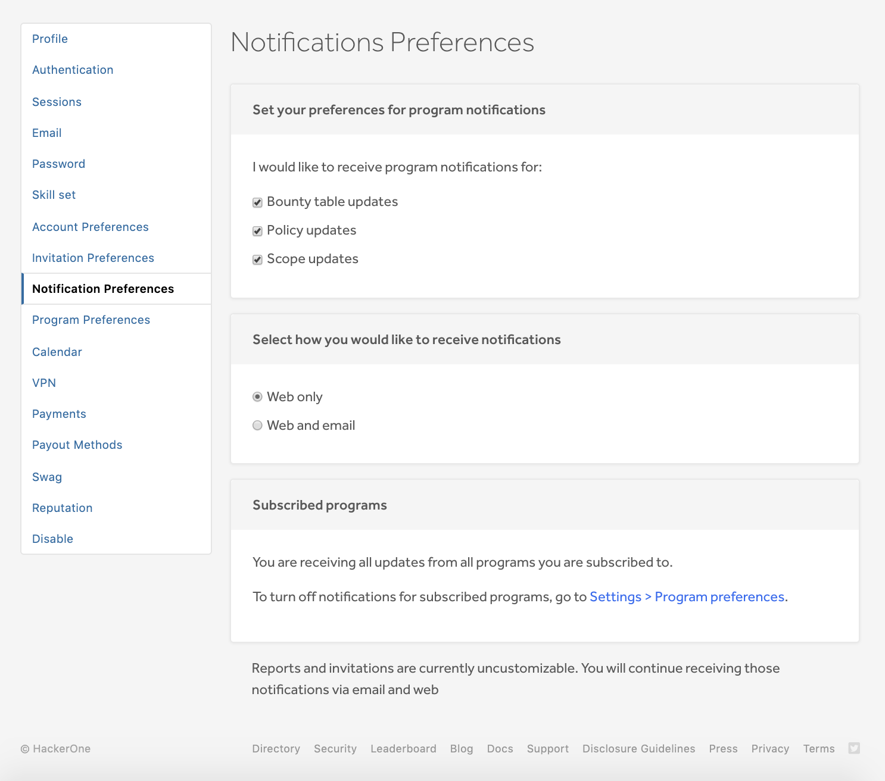
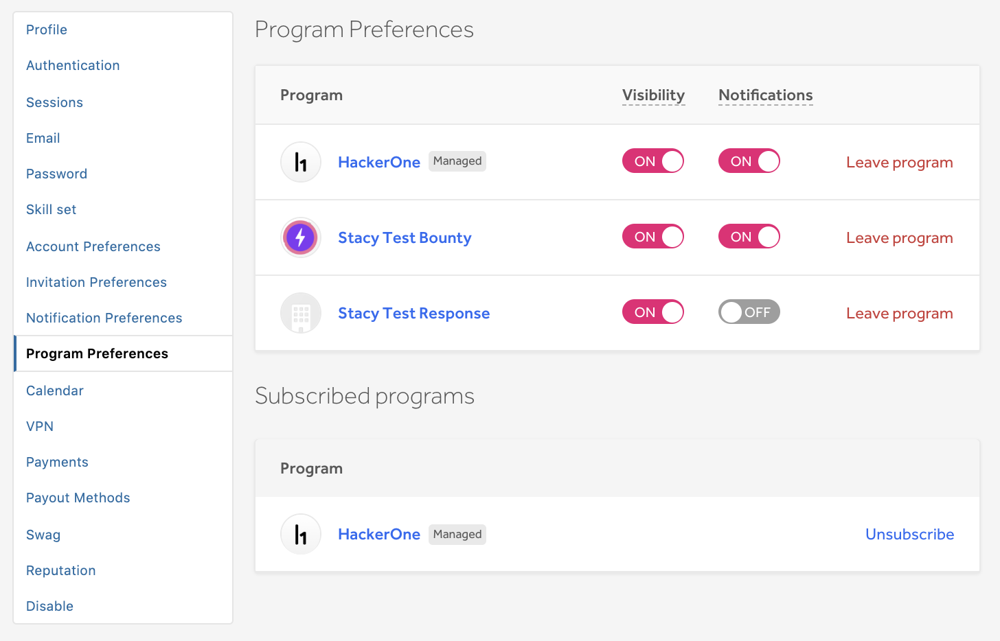
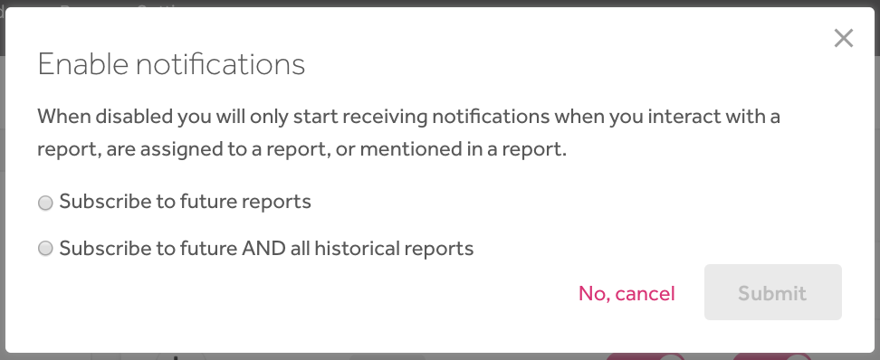
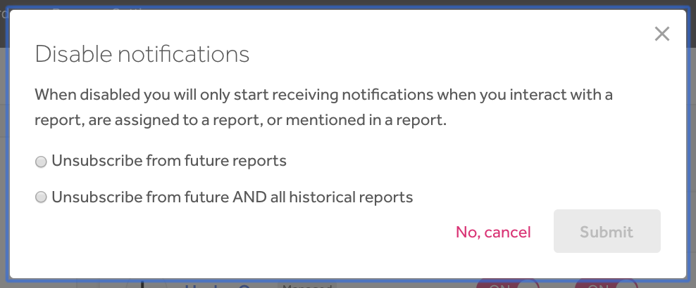

### Program Notifications
As a hacker, you’ll receive notifications (via the product and email) when programs you’re subscribed to make updates. Notifications in the product will appear in the notifications box next to your profile icon.

You can subscribe to receive program update notifications by subscribing to receive notifications via a program's Security Page by clicking **Subscribe**.

Updates to these program settings will trigger notifications:
* Policy
* Bounty table
* Scope
* Hacker messages

### Manage Notifications

#### Notification Preferences
You can manage your notification preferences on the Notification Preferences page under **Settings > Notification Preferences**.

#### Program Preferences
You can also manage what programs you can receive notifications from on the Program Preferences page under **Settings > Program Preferences**. On this page, you can view the full list of programs you belong to as well as the programs you're subscribed to receive notifications for. You can select to turn your notifications to be either **On** or **Off** for each program you're a part of.

To change your notification preferences for a program:

Select whether you want to turn your notifications to be either **On** or **Off** for that program.

Option | Details
------ | --------
On | You'll receive notifications for various program updates. You can select to receive notifications for just future reports or for both future and all historical reports. To manage what updates you receive notifications for, go to **Settings > Notification Preferences**.
Off | Notifications for the program will be disabled. You can select to stop receiving notifications from future reports, or from both future and all historical reports. You'll start receiving notifications for the program again when you:  <li>Interact with a report <li>Are assigned a report <li>Are mentioned in a report
