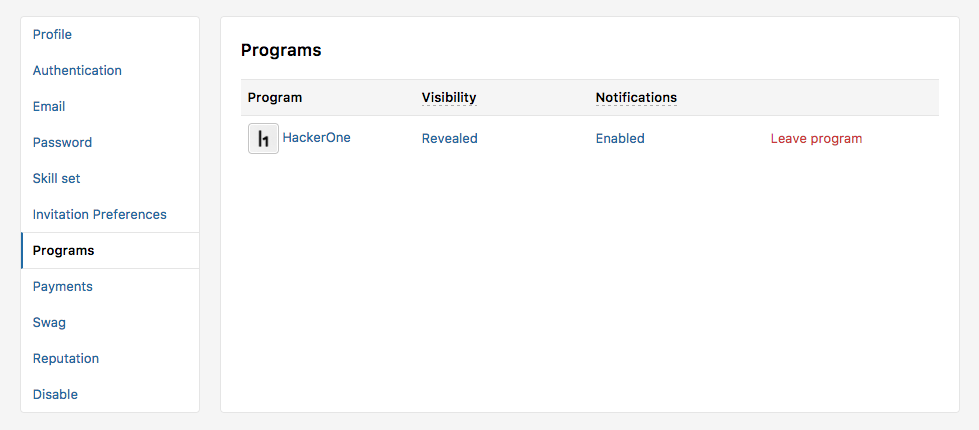
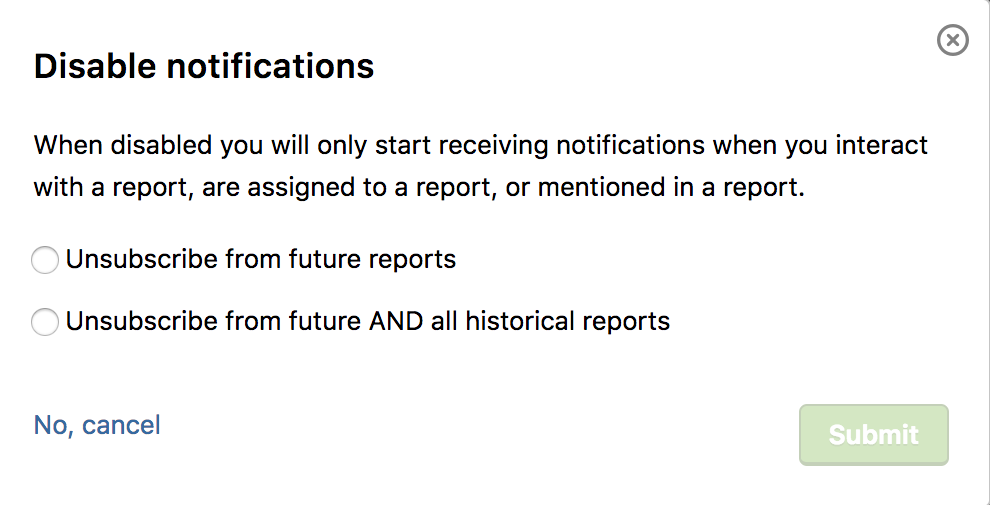
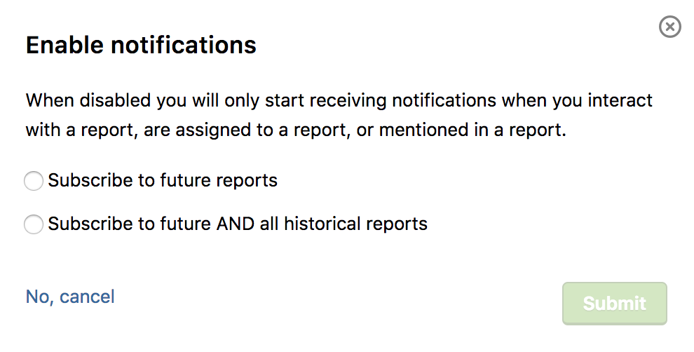

You can manage email notifications you receive from programs you belong to in **Settings > Programs**. On the Programs page, you can view a list of programs you belong to along with the visibility of that program on your public profile as well as your notification settings.

To change your notification preferences for a program:
1. Click on the link below **Notifications** for that program. The link will either say *Enabled* or *Disabled* depending on your existing notification preference.
2. A window will show where you can set your notifications.
   If you want to disable notifications, the **Disable Notifications** screen will show where you can unsubscribe from reports.
   

   If you want to enable notifications, the **Enable Notifications** screen will show where you can subscribe to reports.
   

If you disable your notifications, you'll start receiving notifications again when you:
* Interact with a report
* Are assigned a report
* Are mentioned in a report
