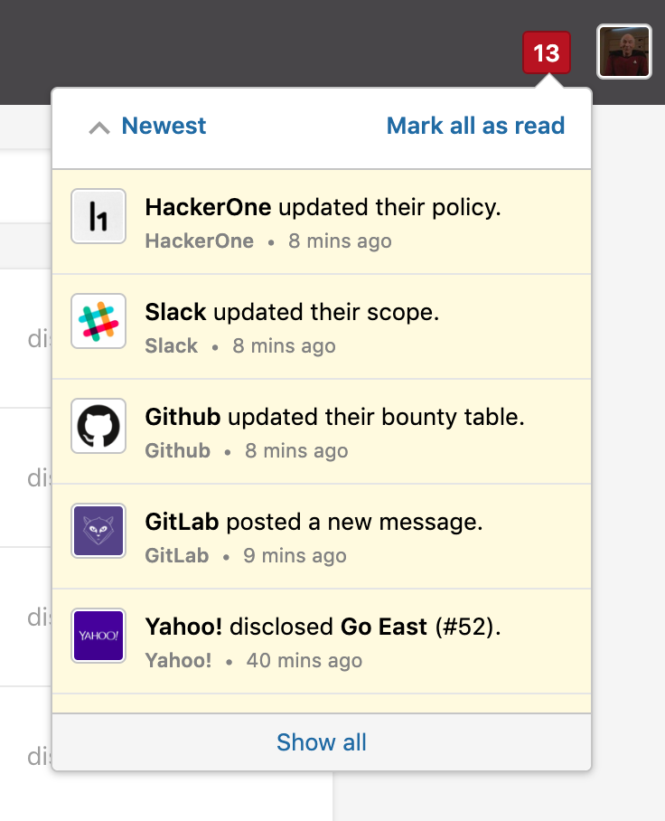

### Program Notifications
As a hacker, you’ll receive notifications (via the product and email) when programs you’re subscribed to make updates. Notifications in the product will appear in the notifications box next to your profile icon.

> **Note:** Receiving program notifications to all program updates is currently only enabled for select hackers.

Updates to these program settings will trigger notifications:
* Policy
* Bounty table
* Scope
* Hacker messages

You’ll be subscribed to receive program update notifications if you’ve expressed interest in a program. This can happen in one of two ways:

Option | Details
------ | -------
Manually | You subscribed to receive notifications via a program’s Security Page by clicking **Subscribe**.   <i>The **Subscribe** button is currently only enabled for select hackers</i>.
Automatically | You'll automatically receive report notifications if you've: <ul><li>Submitted a report to a public program <li>Accepted an invite to a private program

### Manage Notifications
You can manage email notifications you receive from programs you belong to in **Settings > Programs**. On the Programs page, you can view a list of programs you belong to along with the visibility of that program on your public profile as well as your notification settings.

To change your notification preferences for a program:
1. Click on the link below **Notifications** for that program. The link will either say *Enabled* or *Disabled* depending on your existing notification preference.
2. A window will show where you can set your notifications.
   If you want to disable notifications, the **Disable Notifications** screen will show where you can unsubscribe from reports.
   

   If you want to enable notifications, the **Enable Notifications** screen will show where you can subscribe to reports.
   

If you disable your notifications, you'll start receiving notifications again when you:
* Interact with a report
* Are assigned a report
* Are mentioned in a report
