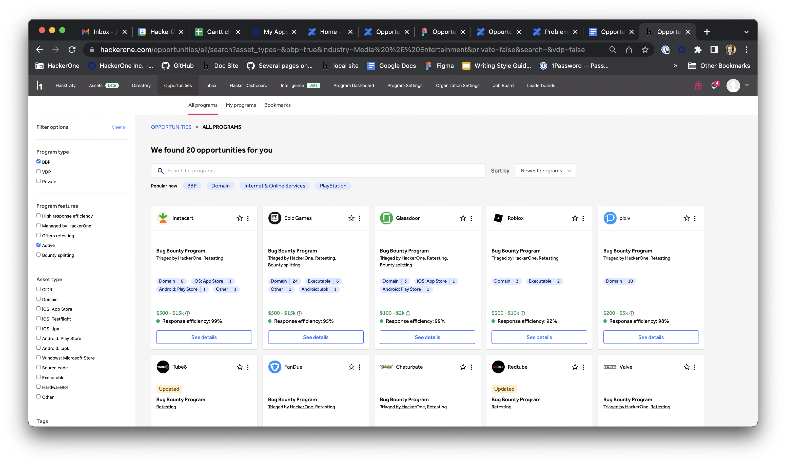

The Opportunity discovery page provides a central place to discover bounty programs, vdps, pentests, and future earning openings, while also solving an inconsistent filtering experience.

We are shifting the program-based focus and opening for future initiatives as an asset-based and recommendation-based experience. We give hackers feedback about the scope changes and new opportunities and open the room to create even more tailored information.

From here, you can search and filter by program name, program type, asset type, or industry. Or you can simply scroll down to see recommended opportunities with the most important information in a card for quick browsing. The recommendations are grouped based on industries, assets, technologies, and bounties

Each program card displays:
* The program name
* Bookmark star
* Feedback menu (3 dots)
* Status tags
* Program features
* Asset types
* Minimum and maximum bounty
* Response standards

*Note: Pentest cards will look slightly different*

If you would like to learn more about the program, click **see details** to go to the program page. You can also click the **star** in the top right corner to favorite a program for easy access later.

Opportunity Discovery gives hackers feedback about the scope changes and new opportunities and opens the door to create even more tailored information. If an opportunity does not interest you or is particularly accurate, you can click the **Feedback Menu** (three dots) in the top right corner to open a menu with the options **show more like this** and **not interested**.

Use the search bar at the top of the page to search for a specific name or filter by program type, asset type, or industry type. You can also sort the results by newest program, oldest program, most reports resolved, or least reports resolved.

