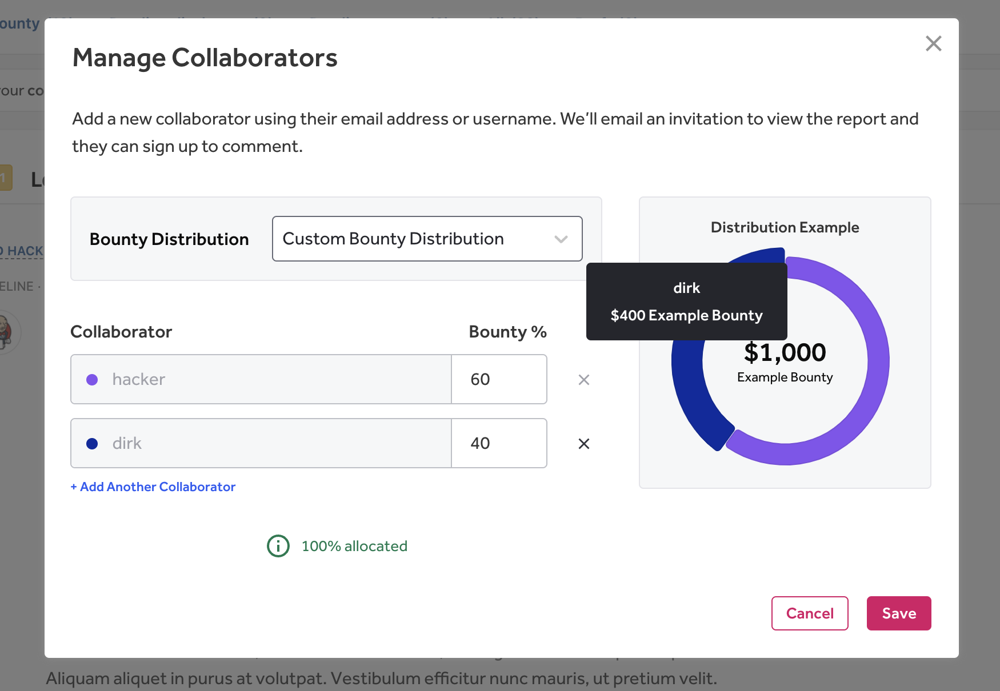

You can receive payments through bounties, swag, and bonuses.

### Bounties

A bounty is money you get rewarded with for reported and resolved bugs. They're used to attract the best hackers and to keep them incentivized to hack their programs. Bounties are used to encourage you to focus on particular assets by altering the reward amount for different vulnerability types. You won't get rewarded for every report you send in, but only for useful, valid reports.

After a program has decided to award you a bounty and the bounty has been awarded, you'll receive an email to claim the bounty. HackerOne will ask to collect your tax form before processing the payout.

#### Collaboration
HackerOne enables you to split bounties with other hackers that helped you find the vulnerability. This allows all hackers to receive contributions and awards for their efforts.

To split a bounty with collaborating hackers:
1. Navigate to the report you'd like to split the bounty with in your HackerOne Inbox.
2. Select <b>Add collaborator</b>.
3. Enter the email or username of the collaborating hacker.
4. Enter the ratio in how you want to split the bounty under <b>Bounty weight</b>.
   * Bounties are split using this equation: (Total Bounty/Total Bounty Weight)x Hacker Bounty Weight
   * In the example below, the calculation would be as follows:
      * hacker: $1000x60% = $600.00
      * dirk: $1000x40% = $400.00
   
5. Click <b>Invite</b>.

The calculated bounty amounts will show for each hacker. When the bounty is awarded, the bounty will be split according to the weights assigned. Additionally, all collaborators can now view and comment on the report. Curious about reputation for collaborative reports? See [here](https://docs.hackerone.com/hackers/reputation.html).

Keep in mind that:
* Bounties can't be split retroactively (i.e. after the bounty has already been awarded).
* You can only add up to 10 collaborators per report.

><i><b>Note:</b> Collaboration is only enabled for programs that use the [prepayment](/organizations/billing.html) billing option.</i>

#### Donating Bounties to Charity
HackerOne enables you to donate your bounty directly to charity.

If you want to donate a bounty:
1. Sign in to your HackerOne account and [submit a support ticket](https://support.hackerone.com).
2. Mention the following in your request:
   * The name and website of the charity you want to donate to.
   * Whether or not you want to be named as the person donating or prefer to remain anonymous. Keep in mind that we can only attribute the donation to you if the charity allows us to give a name.

Upon receiving your request, HackerOne will do a quick check to see if a donation can be made to your selected charity. If for some reason a donation can't be made, HackerOne will notify you so an alternative can be made.

Generally, if the charity accepts donations in USD through PayPal or Credit Card, HackerOne should be able to fulfill your request quickly. If the charity provides an electronic receipt, HackerOne will forward this to you as proof of payment.

Keep in mind that you still need to have a valid tax form on file in order to donate your bounty. You can choose to donate your bounties in full, or you can choose to donate a part of your bounty.

#### Donating through Collaboration
You can also donate your bounties through [Collaboration](payments.html#collaboration). To do this:

1. Follow [steps 1-2](payments.html#collaboration) in the Collaboration section above.
2. Enter `hackforgood` as the username you want to collaborate with.
3. Enter the ratio in how you want to split the bounty under <b>Bounty weight</b>. The explanation for splitting is in [step 4](payments.html#collaboration).
4. Click <b>Invite</b>.

Once a month, HackerOne will donate to the charity of our choice. Currently, the charity is set for The World Health Organization COVID-19 Solidarity Response Fund.

### Swag

Your program can elect to award you with various swag in addition to or instead of bounties. Swag includes merchandise as well as free coupons or vouchers for the services or products the program offers. Some programs also offer to host hackers near their office or cover admissions fees to conferences you're invited to attend.

The program is responsible for fulfillment and delivery of swag to you.

### Bonuses

Programs can award bonuses to recognize hackers for positive actions beyond finding valid vulnerabilities. Bonuses enable programs to offer more flexible incentives without increasing the market rate for bounties.
