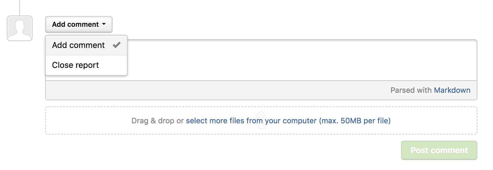
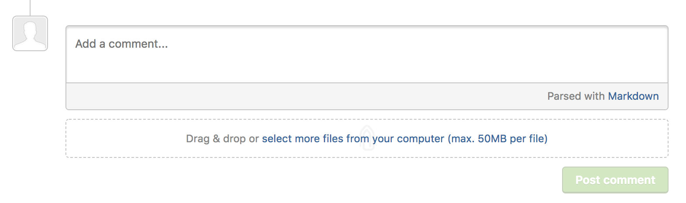
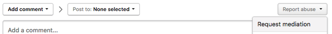

There are 4 actions you can take on a report that you've submitted:
* Add comment
* Self-close
* Request mediation
* Requesting Public Disclosure

### Commenting and Closing a Report
You can dialogue with the program or triager and make notes about the report through adding comments. Additionally, you can self-close your own report and close it as N/A.

To add comments or to close a report:
1. Go to the bottom of the report you want to take action on.
2. In the action picker above the comment box you can choose to **Add comment** or **Close report**.

When the report is in the triaged state, you can only add comments to the report.

### Request Mediation
You can also request for mediation from HackerOne in extreme cases when all normal discussions with the team have been attempted and there has been no satisfactory resolution.

To request mediation, select the **Report abuse** option, and select **Report Mediation**.

### Request Public Disclosure
You can also request public disclosure for your closed reports by selecting **Request public disclosure**. The option is available in your action picker once the report has been closed.

If the program requests for public disclosure, you'll have the option to **Disclose publicly** as well.

><i>Note: Public Disclosure is **Not** available for private programs.</i> 
