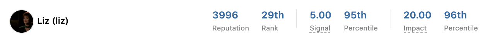
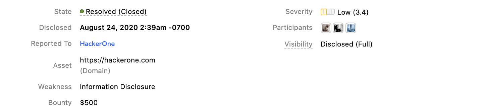
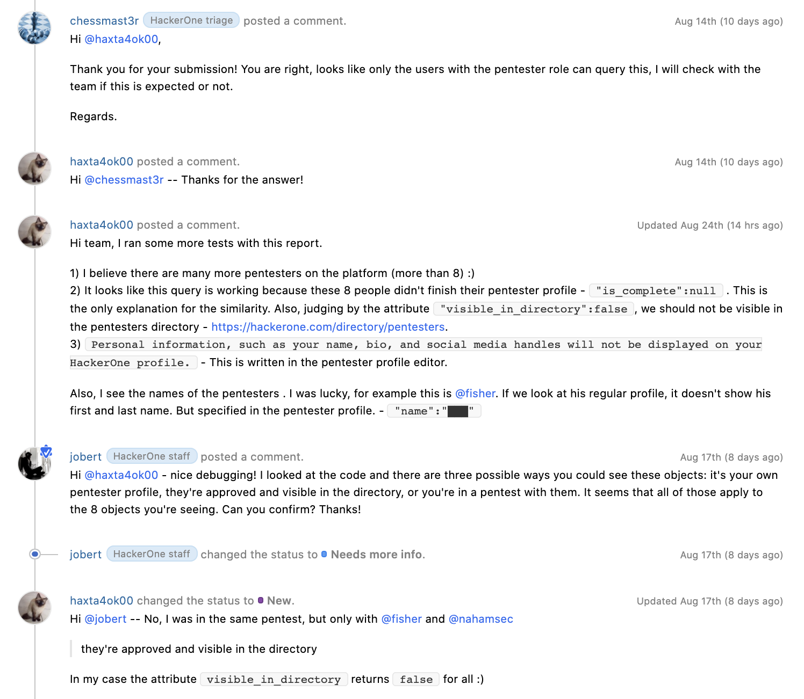

Vulnerability reports consist of different components  that are good to understand when viewing them on hacktivity or in your inbox.

### Hacker Info
The top of the report shows the hacker that submitted the report as well as their hacking statistics by reputation, signal, and impact.

### Report ID and Title
Below the hacker information is the report ID number and title. If you're a contributor to the report, you can change the report title to something more suitable. The color behind the report number represents the state the report is in. These are the different colors and the [report states](report-states.html) they represent:

Color | Report State
----- | ---------
Purple | New
Light Blue | Needs more info
Yellow | [Retesting](retesting.html)
Green | Resolved
Orange | Triaged
Brown | Duplicate
Grey | Informative
Red | Not Applicable

### Report Metadata
You’ll be able to view these metadata fields underneath the title of the report:

Metadata Field | Details
-------------- | --------
State | The state the report is in.
Disclosed | The date the report was disclosed. Only shows for reports that were disclosed.
Reported To | The name of the program the report was submitted to.
Asset | The specific asset the vulnerability was found on.
Weakness | The type of weakness of the vulnerability.
Bounty | (*Only shows for resolved reports that were given a bounty*) How much bounty the report was awarded.   
Severity | The severity level of the vulnerability.
Participants | All of the hackers involved in finding the vulnerability as well as program members involved with triaging the report.
Visibility | Indicates the status of disclosure of the vulnerability.

### Summary
Either your security team or the hacker(s) involved with the report can choose to provide an optional summary of the report. Including a summary helps future viewers of the report to understand the context without having to scroll through the entire report. Click **ADD SUMMARY** to add a summary to the report.

### Timeline
The report timeline shows all of the activity that occurs in the report between the hackers and the program members involved with triaging the report. It will show when:
* A hacker or a program member adds a comment
* The state of the report changes
* A bounty is set
* A bounty has been given
* A hacker requests mediation
* A hacker or program member requests public disclosure  
* An internal activity has been made

The report timeline will also show who is in charge of the next pending action within the report. 

